Informe del Trabajo Final </h1>
<h3 style="text-align: center;"> Universidad Peruana de Ciencias Aplicadas </h3>


<h5 style="text-align: center"> Ingeniería de Software </h5>

<h5 style="text-align: center"> Aplicaciones Web - WS51 </h5>

<h5 style="text-align: center"> Docente: Hugo Allan Mori Paiva </h5>

<h5 style="text-align: center"> Startup: Change4All </h5>

<h5 style="text-align: center"> Producto: StyleShare </h5>

## Team members:
| Nombre |Código|
|:-------:|:----------:|
|||
|More Rondon, Christopher Sebastian|U202212199|
|Cortez Quezada, Joaquin Antonio|U202212648|
|Ramos Najar, Tony Alenxander|U20211A153|
|Agama Espinoza, Eric Fabrizio|U202213358|


<h5 style="text-align: center"> Ciclo 2024-01 </h5>

### Registro de Informes

| Versión   | Fecha       | Autor      | Descripción                                                                                      | Estado    |
|-----------|-------------|------------|--------------------------------------------------------------------------------------------------|-----------|
| 1.0       | 13/04/2024 | Joaquin, Eric, Christopher, Tony | Realizacion del documento |  COMPLETADO |

### Project Report Collaboration Insights

[StyleShare GitHub](https://github.com/upc-pre-202401-SI730-WS51-StyleShare)

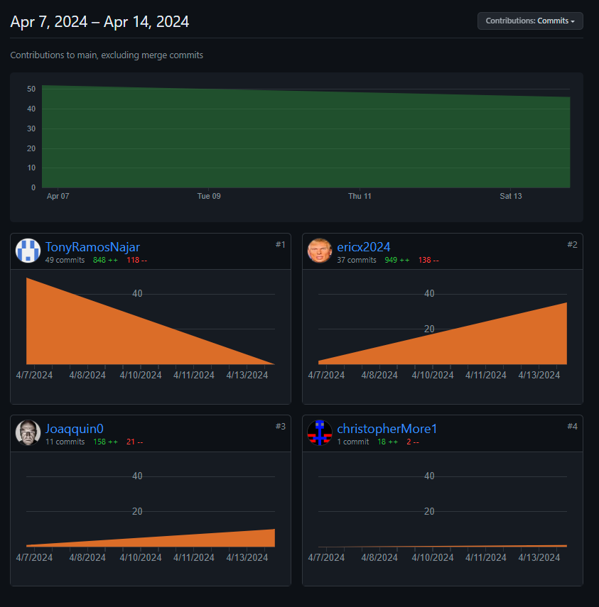

### Student Outcome

|Criterio Especifico|Acciones Realizadas|Conclusiones|
|-------------------|-------------------|------------|
|Comunica oralmente sus <br>ideas y/o resultados con objetividad a <br>público de diferentes <br>especialidades y niveles <br>jerarquicos, en el marco del <br>desarrollo de un proyecto eningeniería.|**Joaquin Cortez**<br>TB1:<br>Para esta entrega se investigó sobre los principios de diseño para la página web para el diseño de los mock ups, considerando las users stories y las funcionalidades core del startup. <br>**Christopher Sebastian**<br>TB1: Para esta entrega me encargue de hallar a nuestros posibles competidores, así como analizar sus puntos fuertes y débiles. También comuniqué durante la exposición cuales son nuestros segmentos objetivos y los requisitos que nuestra aplicación debe cumplir para satisfacer sus necesidades<br><br>**Tony Alexander**<br>TB1: Para esta  entrega me encargué de la formulación del Ubiquitous Language, es fundamental para que nuestro consumidores y nuestra aplicación puedan entenderse, además de implementar el impact Mapping, considerando el user story respectivo posteriormente a mi entrevista realizada<br><br>**Eric Agama**<br>TB1:Durante el proceso de desarrollo de prototipos para nuestros clientes, he reconocido la importancia fundamental de comprender sus necesidades y deseos. Esta comprensión se ha fortalecido a través de conversaciones significativas con mis compañeros, donde intercambiamos ideas y perspectivas para generar soluciones innovadoras y centradas en el cliente.<br>| La comunicación oral ha sido efectiva dentro del equipo, permitiendo un intercambio fluido de ideas y una comprensión compartida de los objetivos del proyecto. Se continuará fomentando esta comunicación para mantener la colaboración y el progreso del trabajo.|
|Comunica en forma escrita ideas <br>y/o resultados con objetividad a <br>público de diferentes <br>especialidades y niveles <br>jerarquicos, en el marco del <br>desarrollo de un proyecto en ingeniería.|**Joaquin Cortez**<br>TB1:<br>Considerando las funcionalidades principales de nuestro proyecto, diseñe los wireframes, mockups y landing page. En cada uno se considero los principios de diseño. Asimismo, siguiendo el modelo ágil, redacte el ux canva y las user stories.  <br>**Christopher Sebastian**<br>TB1: TB1: En el documento rellené el cuadro de competidores, mostrando sus puntos débiles y fuertes al igual que los nuestros. También me encargué de describir las herramientas utilizadas.<br><br>**Tony Alexander**<br>TB1: En el presente documento, implementé la sección colaboración en la Landing Page, principalmente para aquellos que deseen trabajar con nosotros y formar una alianza en el mercado, además de realizar la modificación del documento al formato MarkDown<br><br>**Eric Agama**<br>TB1:Este enfoque colaborativo nos ha permitido crear prototipos que no solo satisfacen las expectativas de nuestros clientes, sino que también superan sus expectativas al ofrecer soluciones que realmente resuelven sus problemas y agregan valor a sus vidas<br>| La comunicación escrita ha sido crucial para documentar el progreso del proyecto y asegurar la comprensión de los entregables entre los miembros del equipo. Se seguirá manteniendo un enfoque claro y conciso en la comunicación escrita para garantizar la eficacia y la calidad del trabajo.|

## Contenido

1. **Capítulo I: Introducción.**
   1. Startup Profile.
        1. Descripción del startup.
        2. Perfiles de los integrantes del equipo.
    2. Solution Profile.
        1. Antecedentes y Problemática.
        2. Lean UX Process.
            1.Lean UX Problem Statements.
            2.Lean UX Assumptions.
            3.Lean UX Hypothesis Statements.
            4.Lean UX Canvas.
    3. Segmentos objetivo.

2. **Capítulo II: Requirements Elicitation & Analysis.**
    1. Competidores.
        1. Análisis competitivo.
        2. Estrategias y tácticas frente a competidores.
    2. Entrevistas.
        1. Diseño de entrevistas.
        2. Registro de entrevistas.
        3. Análisis de entrevistas.
    3. Needfinding.
        1. User Personas.
        2. User Task Matrix.
        3. User Journey Mapping.
        4. Empathy Mapping.
        5. As-is Scenario Mapping.
        6. Ubiquitous Language.
3. **Capítulo III: Requirements Specification.**
    1. To-Be Scenario Mapping.
    2. User Stories.
    3. Impact Mapping.
    4. Product Backlog.
4. **Capítulo IV: Product Design.**
    1. Style Guidelines.
        1. General Style Guidelines.
        2. Web Style Guidelines.
    2. Information Architecture.
        1. Organization Systems.
        2. Labeling Systems.
        3. SEO Tags and Meta Tags
        4. Searching Systems.
        5. Navigation Systems.
    3. Landing Page UI Design.
        1. Landing Page Wireframe.
        2. Landing Page Mock-up.
    4. Web Applications UX/UI Design.
        1. Web Applications Wireframes.
        2. Web Applications Wireflow Diagrams.
        3. Web Applications Mock-ups.
        4. Web Applications User Flow Diagrams.
    5. Web Applications Prototyping.
    6. Domain-Driven Software Architecture.
        1. Software Architecture Context Diagram.
        2. Software Architecture Container Diagrams.
        3. Software Architecture Components Diagrams.
    7. Software Object-Oriented Design.
        1. Class Diagrams.
        2. Class Dictionary.
    8. Database Design.
        1. Database Diagram.
5. **Capítulo V: Product Implementation, Validation & Deployment.**
    1. Software Configuration Management.
        1. Software Development Environment Configuration.
        2. Source Code Management.
        3. Source Code Style Guide & Conventions.
        4. Software Deployment Configuration.
    2. Landing Page, Services & Applications Implementation.
        1. Sprint 1
            1. Sprint Planning 1.
            2. Sprint Backlog 1.
            3. Development Evidence for Sprint Review.
            4. Testing Suite Evidence for Sprint Review.
            5. Execution Evidence for Sprint Review.
            6. Services Documentation Evidence for Sprint Review.
            7. Software Deployment Evidence for Sprint Review.
            8. Team Collaboration Insights during Sprint.
6. **Conclusiones.**
7. **Bibliografía.**
8. **Anexos.**

## Capítulo I: Introducción.

### 1.1. **Startup Profile.**

####     1.1.1.   Descripción del startup

En Change4All, nos dedicamos a transformar la manera en que te vistes para eventos especiales. Nuestra innovadora plataforma, StyleShare ,ofrece una experiencia única en el mundo de la moda. Reconocemos los desafíos de encontrar la vestimenta adecuada para cada ocasión, que puede tomarte mucho tiempo,  resultar costosa y poco sostenible. Por eso, hemos desarrollado una solución digital que te permite alquilar prendas, accesorios y calzado de alta calidad por períodos específicos. En StyleShare, nuestro objetivo es que te sientas increíble en cada evento sin comprometer tu estilo ni tu presupuesto.

#### Misión:
En Change4All, nuestra misión es clara: proporcionarte una manera inteligente y sostenible de vestirte para eventos especiales a través de soluciones tecnológicas avanzadas. Nos esforzamos por garantizar rapidez al momento de escoger tus prendas para que luzcas genial en cada ocasión, a la par que contribuimos a reducir el impacto ambiental de la moda.

#### Visión:
En Change4All,, tenemos una visión ambiciosa para el futuro de la moda. Nos imaginamos liderando el cambio en la forma en que las personas se relacionan con la ropa para eventos en todo el mundo. Visualizamos un mundo en el que el alquiler de prendas sea tan común como comprarlas, donde la moda sea accesible, sostenible y emocionante. Con StyleShare, aspiramos a ser la plataforma global líder en alquiler de prendas y accesorios, inspirando a una comunidad de usuarios a adoptar la moda de una manera nueva y consciente".


####     1.1.2. Perfiles de los integrantes del equipo

| Nombre                           | Descripción                                                                                                                                   |
|----------------------------------|-----------------------------------------------------------------------------------------------------------------------------------------------|
| Christopher Sebastian More Rondon (U202212199) | Me llamo Christopher More, soy estudiante de quinto ciclo de Ingeniería de Software. Soy creativo e ingenioso para resolver problemas creando programas. Siempre intento completar las tareas a tiempo y asegurarme de que se encuentren bien hechas |
|Eric Fabrizio Agama Espinoza (u202213358)  | Mi nombre es Eric Agama y estudio la carrera de Ingeniería de Software. Me considero una persona creativa a la hora de realizar trabajos y buscando siempre las mejores opciones para el equipo. Manejo el lenguaje Luau Roblox Studio.              |             |
|              |          |
| Tony Alexander Ramos Najar (u20211a153)        | Mi nombre es Tony Ramos, estoy cursando el 7mo ciclo de la carrera de Ingeniería de Software. Me considero hábil en el ámbito de la programación en los lenguajes, Python, Javascript, y últimamente estoy aprendiendo Angular. Con respeto a mi, me considero una persona responsable, con ganas de aprender y a superarme a mi mismo. |
| Joaquin Antonio Cortez Quezada (u202212648)        | Mi nombre es Joaquín Antonio Cortez Quezada, tengo 19 años y actualmente estoy  cursando el 5to ciclo de la carrera de Ingeniería de Software en la UPC (Universidad Peruana de Ciencias Aplicadas). Me considero una persona perseverante, responsable, empática en cualquier ámbito de mi vida, ya sea en el aspecto académico. |

### 1.2. **Solution Profile.**

StyleShare es la solución innovadora de Change4All que permite alquilar prendas y accesorios de moda para eventos especiales. Con nuestra plataforma tenemos la idea de crear una comunidad donde los usuarios puedan encontrar prendas únicas y de calidad para ocasiones especiales sin la necesidad de comprarlas. De esa forma, no solo ahorran dinero, sino que también contribuyen a reducir el desperdicio de moda generado por la industria del fast fashion.
### Características clave:

- **Filtros Avanzados de Búsqueda**: Ofrece una amplia gama de filtros para que los usuarios puedan buscar prendas y accesorios de manera rápida y específica, como por tipo de prenda, color, talla, ocasión, etc.

- **Perfiles de Usuario Personalizados**: Permite a los usuarios crear perfiles detallados con sus preferencias de estilo, tallas y eventos futuros para recibir recomendaciones y sugerencias personalizadas.

- **Publicación de Prendas**: Permite a los usuarios publicar sus prendas y accesorios para alquilar. Deben poder agregar fotos de alta calidad y descripciones detalladas. 

- **Asesoría sobre Moda Sostenible**: Proporciona asesorías sobre moda sostenible a los usuarios, contando con la opción de contactar con un asesor en el caso se prefiera tener un trato mas personalizado. 

- **Sistema de Calificaciones y Reseñas**: Implementa un sistema de calificación y reseñas para que los usuarios puedan evaluar la calidad de las prendas y la confiabilidad de otros usuarios.

- **Chat y Comunicación**: Integra una función de chat para que los usuarios puedan comunicarse entre sí, coordinar detalles de intercambio y hacer preguntas sobre las prendas.

- **Sistema de Notificaciones**: Mantén a los usuarios informados sobre las interacciones, nuevos mensajes, solicitudes de intercambio y actualizaciones relevantes.

- **Promoción de Prendas Destacadas**: Permite a los usuarios destacar sus prendas mediante un sistema de promoción, lo que les ayudará a obtener más visibilidad.

- **Diferentes planes de suscripción**: Permite a los usuarios adquirir un plan de suscripción con el cual recibirán beneficios únicos, tanto para los arrendadores como los arrendatarios

- **Historial de Intercambios**: Proporciona a los usuarios un historial detallado de sus intercambios pasados, incluyendo detalles de las prendas y la fecha.


####     1.2.1. Antecedentes y Problemática

### Los 5 'W' y 2 'H'

### 1. What (Qué)
Se refiere a la razón por la cual se está implementando esta metodología. Suele resultar en:

### ¿Cuál es el problema?
Los consumidores se encuentran en la incómoda posición de no tener a su disposición la prenda o accesorio adecuado para su vestimenta deseada. Este desafío se convierte en una experiencia agobiante a medida que los compradores se ven impulsados a realizar gastos excesivos en prendas que terminan usando de manera infrecuente. Esta tendencia no solo lleva a una acumulación innecesaria de ropa, sino que también tiene un impacto ambiental negativo al contribuir al desperdicio de recursos materiales y energéticos en la industria de la moda.

### ¿Cuál es la relación con la persona en cuestión?
La solución brinda a los clientes un canal por el cual pueden adquirir la vestimenta que necesitan.

### 2. When (Cuándo)
Busca el momento cuando ocurre el evento. También puede indicar un período de tiempo o una fecha límite:

### ¿Cuándo sucede el problema?
El problema surge cuando el cliente tiene la necesidad de asistir a un evento social y carece de la vestimenta adecuada.
### ¿Cuándo utiliza el cliente el producto?
Los clientes utilizan el producto cuando necesitan encontrar vestimenta para eventos sociales específicos.

### 3. Where (dónde)
Permite identificar el lugar específico o el lugar afectado por el problema planteado:

### ¿Dónde está el cliente cuando usa el producto?
El cliente se puede encontrar tanto en un ambiente público como privado.
### ¿A dónde se dirige?
Los clientes tienen la intención de asistir a eventos sociales, lo que puede ser en lugares como fiestas, bodas, reuniones, etc.
### ¿Dónde surge el problema?
El problema se origina en el cliente cuando se percata que no cuenta con la vestimenta adecuada para asistir a un evento social.

### 4. Who (quién)
Ayuda a comprender las informaciones importantes de todas las personas involucradas y no necesariamente una sola. Es posible que tengas varios tipos de clientes.

### ¿Quiénes están involucrados?
Los usuarios de la aplicación "StyleShare" están involucrados, tanto aquellos que buscan prendas como aquellos que desean intercambiar sus propias prendas.
### ¿A quiénes le sucede el problema?
El problema afecta a las personas que necesitan vestimenta adecuada para eventos sociales y desean encontrar una solución rentable.
### ¿Quién lo utilizará?
El producto será utilizado por individuos que presenten mayoría de edad y busquen alquilar prendas de vestir.

### 5. Why (por qué)
Está relacionado con la razón o el desencadenante de la situación. Permite encontrar los primeros elementos de respuesta:

### ¿Cuál es la causa del problema?
El problema surge porque los eventos sociales pueden requerir vestimenta específica que no es parte del guardarropa cotidiano de las personas, lo que lleva a la necesidad de adquirir prendas temporales.

### ¿Cuáles son las 2H?
El método de las 5W suele ser completado por las 2H que son How( cómo) y How much (cuánto):

### 1. How (cómo)
Se enfoca en la forma en la cual se llevan a cabo los hechos. Esto es a menudo un elemento importante para la explicación de una situación:

### ¿En qué condiciones los clientes usan nuestro producto?
Los clientes utilizan nuestro producto, EventWear, cuando se enfrentan a la necesidad de encontrar atuendos apropiados para eventos especiales de manera apresurada. Esto incluye situaciones como bodas, fiestas, galas y otros eventos donde se busca un look destacado y adecuado.
### ¿Cómo nos conocieron los compradores?
Los compradores nos conocen a través de varios canales, como redes sociales, publicidad en línea, recomendaciones de amigos y familiares, y búsqueda en motores de búsqueda. También establecemos asociaciones con influencers y colaboraciones con eventos para aumentar nuestra visibilidad.
### ¿Qué llevó a la persona a llegar a esta situación?
Las personas llegan a nuestra solución debido a la necesidad de verse bien y apropiados en eventos sin incurrir en los altos costos y el desperdicio asociado con la compra de ropa que rara vez se utiliza. Además, la conciencia creciente sobre la sostenibilidad en la moda y el deseo de reducir su huella ambiental también influyen en su elección.

### 2. How much (cuánto)
Permite cuantificar el objeto de la problemática en cuestión y, a menudo, evaluar la gravedad:


####     1.2.2. Lean UX Process

#####         **1.2.2.1.Lean UX Problem Statements.**

Hemos identificado que las personas que buscan vestimenta para eventos especiales a menudo enfrentan el desafío de gastar más tiempo del que desean para buscar prendas con las cuales asistir a eventos, aparte les genera un gastos excesivos y acumulación de prendas poco utilizadas en sus armarios. Esto puede llevar a una experiencia frustrante y poco sostenible en la industria de la moda.
##### ¿Cómo podremos brindarles a las personas una solución que les permite ahorra tiempo y dinero al momento de buscar prendas para eventos específicos sin contribuir al desperdicio de la moda?
Nuestra solución aborda este problema al proporcionar una plataforma de aplicación web que permite a los usuarios alquilar y rentar prendas y/o accesorios de moda para eventos especiales. A través de una amplia variedad de opciones, una interfaz amigable y opciones de alquiler flexibles.

#####         **1.2.2.2.Lean UX Assumptions.**

##### **Business Assumptions**:
- Existe una demanda en el mercado de soluciones tecnológicas que faciliten el alquiler de prendas y accesorios de moda.
- Los consumidores muestran disposición para alquilar prendas y accesorios en lugar de adquirirlos de forma definitiva
- Los usuarios priorizan la sostenibilidad y la reducción del desperdicio en la industria de la moda al considerar opciones de alquiler.
- Los usuarios buscan disponer de opciones de vestimenta específicas adecuadas para eventos y ocasiones especiales.
- Los propietarios de prendas y accesorios están dispuestos a ofrecer sus artículos en alquiler a través de la plataforma.
- Los usuarios valoran la comodidad y la variedad al seleccionar prendas y accesorios en la plataforma.
- La facilidad de navegación y un diseño intuitivo en la aplicación son aspectos fundamentales para su adopción por parte de los usuarios.
- La retroalimentación y los comentarios de los usuarios son considerados valiosos para mejorar continuamente la experiencia de la plataforma.
- La promoción y la visibilidad en redes sociales y eventos de moda juegan un papel crucial en la captación de usuarios.

##### **Business Outcomes** :
- Reducción del exceso en la industria de la moda: EventWear tiene el potencial de disminuir la acumulación de prendas poco utilizadas en los armarios, fomentando así prácticas más sostenibles en la moda.
- Impulso de la sostenibilidad: Al optar por el alquiler en lugar de la compra, los usuarios contribuyen a reducir la demanda de producción masiva de ropa, lo que a su vez beneficia al medio ambiente.
- Acceso ampliado a prendas de calidad: La plataforma ofrece a los usuarios acceso a prendas y accesorios de alta calidad para eventos especiales sin necesidad de realizar una inversión completa en ellas.
- Experiencia personalizada: Los usuarios tienen la posibilidad de elegir entre una amplia gama de opciones para adaptar su atuendo a eventos específicos, lo que aumenta su satisfacción y confianza.
- Generación de ingresos para propietarios: Los propietarios de prendas y accesorios pueden obtener ingresos adicionales al poner sus artículos en alquiler, lo que contribuye a fomentar una economía circular.
- Promoción de la moda sostenible: EventWear puede desempeñar un papel importante como defensor de la moda sostenible, educando a los usuarios sobre las implicaciones del fast fashion y promoviendo alternativas más conscientes.

##### **User Assumptions**:
- Los consumidores muestran interés en adoptar prácticas de moda más sostenibles: Los usuarios están cada vez más conscientes de la importancia de la sostenibilidad en la moda y buscan participar en un consumo más responsable.
- Existe disposición por parte de los usuarios a alquilar prendas y accesorios en lugar de comprarlos: Los consumidores reconocen el valor de la variedad y la conveniencia que ofrece el alquiler en comparación con la propiedad.
- La demanda de opciones de moda específicas para eventos es alta entre los usuarios: Los consumidores buscan opciones de moda adecuadas y apropiadas para diferentes ocasiones y eventos.
- Los propietarios de prendas y accesorios ven el alquiler como una oportunidad: Los propietarios consideran que el alquiler es una manera eficaz de aprovechar sus artículos no utilizados y generar ingresos adicionales.
- Los usuarios buscan una plataforma intuitiva y conveniente para el alquiler de moda: Los consumidores desean una experiencia de usuario fluida y sin complicaciones al utilizar la plataforma de alquiler de moda.

##### **User**:
Los usuarios potenciales que podrían utilizar la solución EventWear :
- Consumidor casual de moda: Personas que buscan opciones de vestimenta sostenibles y asequibles para eventos especiales, valorando la variedad y la responsabilidad ambiental.
- Propietarios de prendas y accesorios: Personas que tienen artículos de moda que desean alquilar para generar ingresos adicionales y contribuir a la economía circular.
- Asistente a eventos consciente de la moda : Personas que desean lucir bien en eventos especiales sin incurrir en altos costos y que buscan una experiencia de alquiler cómoda y personalizada.

##### **User Benefits**:
- Consumidores conscientes de la moda: Los usuarios pueden lucir bien en eventos especiales sin la carga de la propiedad, lo que ayuda a reducir el desperdicio de moda y contribuye a la sostenibilidad ambiental.
- Propietarios de prendas y accesorios: Los propietarios tienen la oportunidad de generar ingresos alquilando artículos no utilizados, al tiempo que apoyan un enfoque más sostenible en la moda.
- Asistentes a eventos: Los usuarios pueden acceder a prendas y accesorios de moda de alta calidad para eventos específicos sin la necesidad de comprar, lo que les permite ahorrar dinero y reducir el desperdicio.

##### **Feature Assumptions**: 
- Interfaz Intuitiva y Accesible: Suponemos que los usuarios de EventWear prefieren una experiencia simple y sin complicaciones al explorar y alquilar prendas y accesorios. Por lo tanto, es esencial que nuestra página cuente con una interfaz de usuario intuitiva y accesible, lo que facilitará que los usuarios naveguen y seleccionen prendas de manera eficiente.
- Catálogo Variado y Actualizado: Suponemos que los usuarios valoran tener una amplia variedad de opciones de moda para elegir. Por lo tanto, es crucial mantener nuestro catálogo actualizado con una amplia gama de prendas y accesorios adecuados para diferentes tipos de eventos.
- Proceso de Alquiler Simple y Rápido: Suponemos que los usuarios prefieren un proceso de alquiler sin complicaciones. Por ende, nuestra plataforma debe ofrecer un proceso de alquiler simple y rápido, con pasos claros desde la selección hasta la finalización del pedido.
- Notificaciones y Recordatorios Efectivos: Suponemos que los usuarios aprecian las notificaciones que les ayudan a estar al tanto de fechas importantes, como la fecha del evento y la devolución de prendas. Por lo tanto, debemos incluir notificaciones y recordatorios efectivos para mantener a los usuarios informados.
- Descripciones Detalladas y Calidad Visual: Suponemos que los usuarios desean tomar decisiones informadas al alquilar prendas y accesorios. Por lo tanto, debemos proporcionar descripciones detalladas de cada artículo, incluyendo información sobre el tamaño, material y ajuste. Además, imágenes de alta calidad son esenciales para que los usuarios visualicen claramente cada prenda.
- Proceso de Devolución sin Complicaciones: Suponemos que los usuarios desean una experiencia fluida al devolver prendas al finalizar el alquiler. Por lo tanto, debemos ofrecer un proceso de devolución sencillo y claro, que incluya instrucciones claras y opciones de envío de devolución.
- Comentarios y Valoraciones de Usuarios: Suponemos que los usuarios confían en las opiniones de otros usuarios al seleccionar prendas. Por lo tanto, debemos permitir que los usuarios dejen comentarios y valoraciones sobre las prendas que han alquilado, lo que proporcionará información adicional a futuros usuarios.
- Seguridad en los Pagos y Datos: Suponemos que la seguridad de los datos y las transacciones es fundamental para los usuarios al alquilar prendas en línea. Por lo tanto, debemos implementar medidas de seguridad robustas para proteger la información financiera y personal de los usuarios.
- Soporte al Cliente Eficaz: Suponemos que los usuarios pueden tener preguntas o problemas durante su experiencia en la plataforma. Por lo tanto, debemos ofrecer opciones de soporte al cliente eficaces, como chat en vivo o asistencia por correo electrónico, para ayudar a los usuarios con sus consultas.


#####         **1.2.2.3.Lean UX Hypothesis Statements.**

##### **Hypothesis Statement 1**:
Creemos que, sí ofrecemos una página intuitiva y de fácil manejo a los usuarios que les interesa alquilar prendas y accesorios para eventos específicos, incrementaremos la satisfacción del cliente.
Sabremos que tendremos éxito al observar un aumento del 20% de los usuarios activos después de 4 semanas de su lanzamiento y recibimos comentarios positivos sobre su fácil uso.
##### **Hypothesis Statement 2**:
Creemos que, así ofrecemos una variedad de prendas de alquiler con un precio competitivo en comparación con la compra de ropa para eventos especiales, motivamos a los usuarios a alquilar una prenda en nuestra plataforma
Sabremos que tendremos éxito al observar un aumento del 10% de nuevos usuarios que prueban la aplicación y alquilan cualquier tipo de prenda en los primeros 3 meses, lo que indica que presentamos una propuesta con valor para el usuario
##### **Hypothesis Statement 3**:
Creemos que, si implementamos recomendaciones de prendas según los gusto de los usuarios, estos podrán encontrar nuevas prendas que podrían ser de su interés sin tener que hacer una búsqueda exhaustiva por los filtros de búsqueda de la plataforma.
Sabremos que tendremos éxito al observar un aumento del 30% en el uso de recomendación personalidades por parte de todos los usuarios que utilizan la aplicación en un lapso de 6 meses después de estar disponible esta opción 
##### **Hypothesis Statement 4**:
Creemos que si colaboramos con tiendas locales de moda para ampliar nuestra oferta de prendas y accesorios disponibles para alquilar, aumentaremos la diversidad y atractivo de nuestro catálogo, lo que incentivará a más usuarios a utilizar nuestra plataforma. 
Sabremos que hemos tenido éxito cuando observamos un aumento del 30% en la cantidad de prendas y accesorios disponibles en nuestra plataforma a través de asociaciones con tiendas locales.


#####         **1.2.2.4.Lean UX Canvas.**

| Lean UX Canvas | Título: EventWear | Fecha: 28/03/24 |
|---------------------|----------------------|--------------|
|Business Problems <br><br><br> - La experiencia frustrante y poco sostenible en la industria de la moda, la cual es provocada por gastos excesivos y grandes acumulaciones de ropa al momento de realizar la compra de un producto de vestimenta para un evento especial | Solution Ideas <br><br><br>  - Desarrollar una aplicación web intuitiva y fácil de usar que permita a los usuarios alquilar prendas, accesorios y calzado para eventos específicos.<br> - Crear un catálogo diverso y actualizado de prendas y accesorios de moda que se adapten a diferentes estilos y ocasiones.<br> - Implementar una función de recomendación personalizada basada en las preferencias y ocasiones de los usuarios.<br>- Ofrecer opciones de alquiler a corto y largo plazo para satisfacer diferentes necesidades de eventos | Business Outcomes <br><br><br> - Aumento de la eficiencia en la organización de eventos y la gestión de vestimenta. <br> - Mejora de la satisfacción del cliente al ofrecer una solución sostenible y asequible.<br> - Generación de ingresos a través de las tarifas de alquiler y posibles planes de suscripción.<br> - Posibilidad de colaboraciones y asociaciones con marcas de moda locales.
| User & Customers <br><br><br> - Usuarios: Personas que asisten a eventos y desean alquilar prendas y accesorios para ocasiones específicas.<br>  - Clientes: Individuos que realizan alquileres a través de la plataforma | | User Benefits <br><br><br>- Permitir a los clientes ahorrar tiempo al momento de comprar un producto adecuado a su gusto.<br> - Evitar que el cliente se vea obligado a visitar diferentes tiendas para encontrar un producto.
| Hypothesis<br><br><br> - Creemos que sí ofrecemos una variedad diversa y actualizada de prendas y accesorios de moda en nuestra plataforma, aumentaremos la satisfacción del cliente y la probabilidad de alquileres repetidos.<br> - Creemos que al colaborar con marcas sostenibles y locales, podremos ampliar nuestra oferta de productos y atraer a un público más amplio y consciente de la sostenibilidad.| What's the most important thing we need to learn first?<br><br><br> - Aprender sobre las opciones de alojamiento web y servidores para asegurarse de que puedan manejar la carga de usuarios y la cantidad de datos necesaria para la plataforma.<br> - Adquirir conocimientos en diseño de UX y UI para crear una interfaz de usuario intuitiva y atractiva que mejore la experiencia de los usuarios al interactuar con la plataforma.<br> - Adquirir habilidades en pruebas y depuración de software para identificar y corregir errores y problemas antes de lanzar la plataforma al público.| What's the least amount of work we need to do to learn the next most important thing?<br><br><br> - Desarrollar prototipos del producto de software para brindar un primer acercamiento de cómo se verá y funcionará el programa.<br> - Realizar un análisis del público objetivo mediante el uso de entrevistas de usuario para conocer sus opiniones y puntos de vista.<br> - Familiarizarse con los lenguajes, frameworks y entre otras herramientas de programación que puedan ser vitales para el desarrollo del producto.|


### 1.3. **Segmentos objetivo.**

Nuestro segmento objetivo lo conforman las personas las cuales asisten con mayor o menor frecuencia diferentes eventos especiales y buscan una manera rentable, eficiente y sostenible de obtener la prenda o accesorias que necesitan.
Consumidores conscientes de la moda: Los usuarios pueden lucir bien en eventos especiales sin el gasto de tiempo y dinero, reduciendo el desperdicio de moda y contribuyendo a la sostenibilidad.
#### **Segmento 1: Consumidores conscientes de la moda**
##### Aspectos demográficos: 
##### Sexo: Masculino y femenino
##### Edades: Adultos entre 20 - 45 años
##### Nacionalidad: Peruana
##### Zona geográfica en la que viven: Urbana
##### Departamento: Lima Metropolitana
##### Aspectos psicográficos:
- Disfrutan de asistir a una variedad de eventos sociales y especiales, como fiestas, bodas, cenas formales, eventos de negocios, etc.
- Tienen un estilo de vida activo y socialmente comprometido, lo que los lleva a requerir una variedad de prendas.
- Valoran la comodidad y la conveniencia, buscando soluciones prácticas y rentables para satisfacer sus necesidades de vestuario.
- Están conscientes del impacto ambiental de la moda.
- Desean lucir bien en eventos especiales sin incurrir en grandes gastos y contribuir al medio ambiente al reducir el desperdicio de moda.
 
 
#### **Segmento 2: Propietarios de prendas y accesorios**
 
##### Aspectos demográficos:
##### Sexo: Masculino y femenino
##### Edades: Adultos entre 30 – 60 años
##### Nacionalidad: Peruana
##### Zona geográfica en la que viven: Urbana
##### Departamento: Lima Metropolitana
##### Aspectos psicográficos:
- Son personas que tienen una variedad de prendas y accesorios de moda.
- Están interesados en contribuir a un enfoque más sostenible en la moda.
- Desean generar ingresos adicionales alquilando artículos no utilizados.
- Valorizan la comodidad y la conveniencia en el proceso de alquiler de sus prendas.
- Están conscientes del impacto ambiental de la moda y desean contribuir a reducir el desperdicio de prendas.


## Capítulo II: Requirements Elicitation & Analysis

### 2.1. **Competidores.**

####     2.1.1. Análisis competitivo.

##### Olibati: Página para comprar o Alquilar ropa de distintos tipos
[Olibati](https://olibati.com/pages/como-alquilar)

##### My wardrobe HQ: Página para alquilar ropa, la cual también ofrece una opción de suscripción para poder conseguir un número determinado de items cada mes
[My wardrobe HQ](https://www.mywardrobehq.com/) 

##### Rent the Runaway: Plataforma que permite acceder a suscripciones por distintos precios, con las cuales se puede rentar una cantidad definida e items y mantenerlos mientras se siga siendo socio
[Rent the Runaway](https://www.renttherunway.com/)

### Análisis de Competencia

##### ¿Por qué llevar a cabo este análisis?
Este análisis se llevará a cabo para tener una idea de qué clase de tácticas usa la competencia, así como tener en claro sus puntos fuertes y débiles. Todo esto con el objetivo de diseñar una estrategia que ayude a nuestra marca a sobresalir.

##### Comparativa con Competidores

|               | StyleShare                                                    | Olibati                                                             | My Wardrobe HQ                                                              | Rent the Runaway                                               |
|---------------|--------------------------------------------------------------|--------------------------------------------------------------------|--------------------------------------------------------------------------------------|-----------------------------------------------------------------|
| **Perfil**    |                                                              |                                                                    |                                                                                      |                                                                 |
| **Overview**  | Servicio para alquilar ropa, el cual permite conseguir suscripciones tanto para los compradores como para los vendedores | Página web desde la que se puede rentar ropa, o en caso se desee, comprarla por un precio más alto | Página web desde la cual puedes rentar o comprar ropa, y la que además cuenta con suscripciones para sus usuarios        | Servicio que por medio de suscripciones permite a los usuarios rentar distintas ropas según su nivel de suscripcion |
| **Ventaja competitiva** ¿Qué valor ofrece a los clientes? |   Suscripciones que permiten a los compradores alquilar un número definido de ropa, y a los vendedores obtener mayor ganancia   |  Sí una vestimenta les gusta mucho, pueden elegir comprarla para quedarse con ella permanentemente   |   Suscripción que les permite conseguir una cantidad de items cada mes e intercambiarlos si no les convencen  |  Cuenta con distintas opciones de suscripción con distintos precios y beneficios  |  |
| **Perfil de Marketing** |                                                              |                                                                    |                                                                                      |                                                                 |
| **Mercado objetivo** |  Personas que necesitan ropas constantemente para eventos sociales, y gente que desea obtener dinero alquilando sus vestimentas  |    Personas que necesitan alquilar ropa para algún evento o salida con amigos     |   Personas que desean rentar ropa para usarla por un periodo de tiempo y luego cambiarla por otra     |    Personas que desean tener la oportunidad de cambiar su estilo de ropa constantemente, pero que no cuentan con gigantescas cantidades de dinero      |
| **Estrategias de Marketing** |                Mostrar las ventajas de las suscripciones para usuarios constantes                  |     Ropa de distintas marcas        | Presencia de varias marcas entre su catálogo  |  Contactos con diseñadores reconocidos, y distintos planes de suscripción
| **Perfil de Producto** |                                                              |                                                                    |                                                                                      |                                                                 |
| **Productos y Servicios** | Alquiler de ropa | Alquiler y venta de ropa | Alquiler y compra de ropa | Alquiler de ropa |
| **Precios y Costos** | Varía según la vestimenta o suscripción | Varía según la ropa | Varía entre la ropa, y suscripción desde 60 dólares al mes |  Membresías desde 95 dólares al mes |
| **Canales de Distribución** | Página web | Página web | Página web | Página web |
| **Análisis FODA** |                                                              |                                                                    |                                                                                      |                                                                 |
| **Fortalezas** | Amplia variedad de ropas para toda clase de evento |  Poder comprar la ropa alquilada | Posibilidad de cambiar la ropa alquilada por otra | Poder cambiar la ropa alquilada, y contar con distintas opciones de suscripción |
| **Debilidades** | Varios vendedores puede pasar desapercibidos entre la gran cantidad de usuarios | Bastante costosa si se desea comprar | Precios muy altos | Los precios pueden llegar a ser demasiado altos |
| **Oportunidades** | Personas que asisten constantemente a eventos sociales y no desean comprar ropa | Consumidores que necesitan ropa para usar en contadas ocasiones | Personas que buscan cambiar de ropa cada cierto tiempo | Personas que desean cambiar constantemente de ropa y tiene una cantidad de dinero alta |
| **Amenazas** | Negocios más conocidos y con más prestigio | Negocios con precios más bajos | Negocios que tengan opciones de renta más baratas | Otros negocios con precios más accesible |


####     2.1.2. Estrategias y tácticas frente a competidores.


##### Mostrar vendedores nuevos: La página principal también contará con la opción de visualizar la ropa recién puesta en renta, de modo que los nuevos vendedores tengan oportunidad de ser notados

##### Mostrar reseñas: Los vendedores serán calificados por los usuarios, permitiendo a los demás usuarios alquilar ropa con confianza

##### Remarcar tipos de vestimenta: Se mostrarán filtros para elegir las distintas clases de ropa que poseemos, dándole a entender al usuario la amplia variedad de opciones que tiene


### 2.2. **Entrevistas.**

####     2.2.1. Diseño de entrevistas.

#### **Segmento Objetivo 1: Consumidores conscientes de la moda**
 
- ¿Cuál es su nombre completo?
- ¿Qué edad tiene?
- ¿Donde suele buscar su ropa para eventos sociales?
- ¿En alguna ocasiones le ha resultado difícil encontrar una prenda específica para algún evento?
- ¿Cuál es el mayor desafío que usted se encuentra al momento de buscar la vestimenta adecuada para un evento social ?
  
**(Preguntas específicas para el segmento:)**
- ¿Con qué frecuencia asistes a eventos sociales que requieren una vestimenta especial?
- ¿Suele demorar en encontrar prendas a su gusto para asistir a estos tipos de eventos?
- ¿Qué tan interesado estás en alquilar una prenda para un evento , consideras que es más sostenible para el medio ambiente? 


<br>

#### **Segmento Objetivo 2: Propietarios de prendas y accesorios**
- ¿Cuál es su nombre completo?
- ¿Qué edad tiene?
- ¿Donde suele buscar su ropa para eventos sociales?
- ¿En alguna ocasiones le ha resultado difícil encontrar una prenda específica para algún evento?

**(Preguntas específicas para el segmento:)**
- ¿Qué lo motivó a considerar la idea de alquilar sus prendas y accesorios?
- ¿Qué tipo de prendas y accesorios estaría dispuesto a alquilar?
- ¿Considera que al poner sus prendas en alquiler puede contribuir a reducir el desperdicio de moda?
- ¿Cómo crees que el alquiler de tus prendas y accesorios podría beneficiarte?
- ¿Qué tan importante es para ti la sostenibilidad y la ecoconciencia al decidir alquilar tus prendas y accesorios?


####     2.2.2. Registro de entrevistas.


##### *Entrevista 1:* 
*Segmento 1*
#### Sexo: 
Masculino
#### Edad: 
22
####Ubicación: 
Pueblo Libre
#### Link: 
[Entrevista1](https://drive.google.com/file/d/1tr9UEtZp96kZAB-MYiY1wwgAIN4c8L-n/view?usp=sharing)
#### Duración: 
2:50
#### Resumen: 
Nicolas suele buscar sus prendas en las marcas que ya conoce y ha probado, en pocas ocasión no ha podido encontrar la prenda deseada para un conjunto de vestimenta en específico, en estos casos tuvo que cambiar por completo su idea principal de vestimenta. Cada que quiere una prenda siempre se fija en los materiales, siempre descartando materiales sintéticos, por eso considera importante revisar el porcentaje de algodón en una prenda ya que influye en su decisión al momento de comprar. Por otro lado, en las reuniones a las que asiste con amistades suele asistir con ropa casual y debía a que, solamente estudiando, las reuniones con ropa formal son muy poco habituales 


##### *Entrevista 2:* 
*Segmento 2*
#### Sexo: 
Masculino
#### Edad: 
19
#### Ubicación: 
San Miguel
#### Link:
[Entrevista2](https://drive.google.com/file/d/1VR7aKPYC2SbDGGKgvwq5vhcAfPMW6kuM/view?usp=sharing)
#### Duración: 
3:35
#### Resumen:
El entrevistado suele realizar sus compran en gamarra, o en distintas tiendas de marcas, por lo que generalmente no tiene problemas para encontrar prendas. Respecto al alquiler de ropa, se encuentra interesado exclusivamente en el alquiler de ropa que sea usada en ocasiones especiales, como por ejemplo un terno, debido a que no suelen ser usadas frecuentemente. Finalmente, coincide en que el alquiler de ropa ayuda a disminuir la contaminación, siendo algo especialmente necesario en estos tiempos debido a la amenaza de la contaminación.


##### *Entrevista 3:*
*Segmento 2*
#### Sexo: 
Femenino
#### Edad: 
25
#### Ubicación: 
Ate Vitarte
#### Link:
[Entrevista3](https://youtu.be/gAE-CfzRKqs)
#### Duración: 
3:42
#### Resumen: 
La entrevista fue con Sandy Ingaruca, de 25 años, quien busca su ropa para eventos sociales en tiendas locales y en línea, priorizando marcas que se ajusten a su estilo. A veces le resulta difícil encontrar prendas específicas para eventos. Se motivó a considerar el alquiler de sus prendas para ganar dinero extra y reducir el desperdicio de moda. Estaría dispuesta a alquilar prendas como vestidos de fiesta, trajes formales, y accesorios. Cree que al alquilar sus prendas puede contribuir a reducir el desperdicio de moda. Considera importante la sostenibilidad y la ecoconciencia al decidir alquilar sus prendas.


####     2.2.3. Análisis de entrevistas.


#### **Entrevista 1:**
Nicolas: Se destaca su preferencia por marcas conocidas y la importancia que otorga a los materiales de las prendas, prefiriendo evitar materiales sintéticos. También se menciona que en sus reuniones con amigos suele vestir de forma casual, ya que las ocasiones formales son poco habituales para él. En cuanto al alquiler de ropa, parece estar más enfocado en prendas para ocasiones especiales como un terno, que no suele usar con frecuencia.

#### **Entrevista 2:**
Franco: Este entrevistado suele comprar en lugares específicos como Gamarra y tiendas de marcas, lo que facilita encontrar prendas. Está interesado en el alquiler de ropa para ocasiones especiales, como un terno, que no se usaría con frecuencia. Coincide en que el alquiler de ropa puede ayudar a reducir la contaminación, lo que muestra su conciencia ambiental.

#### **Entrevista 3:**
Sandy Ingaruca: Se menciona que Sandy busca su ropa para eventos sociales en tiendas locales y en línea, buscando marcas que se ajusten a su estilo. A veces le resulta difícil encontrar prendas específicas para eventos, lo que puede reflejar una mayor exigencia en cuanto a sus elecciones de vestuario. Se destaca su motivación para considerar el alquiler de prendas, que incluye ganar dinero extra y reducir el desperdicio de moda. Está dispuesta a alquilar prendas para ocasiones especiales y considera importante la sostenibilidad al decidir alquilar sus prendas.


### 2.3. **Needfinding.**

####     2.3.1. User Personas.

## Segmento 2

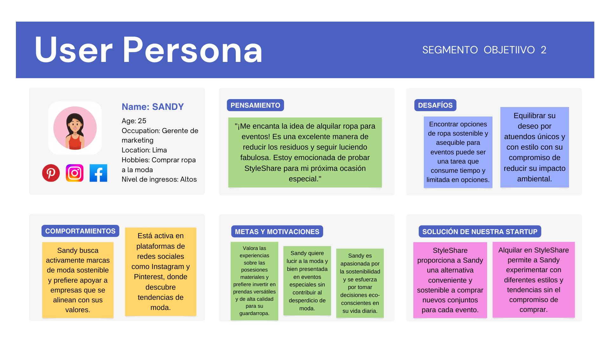

## Segmento 1
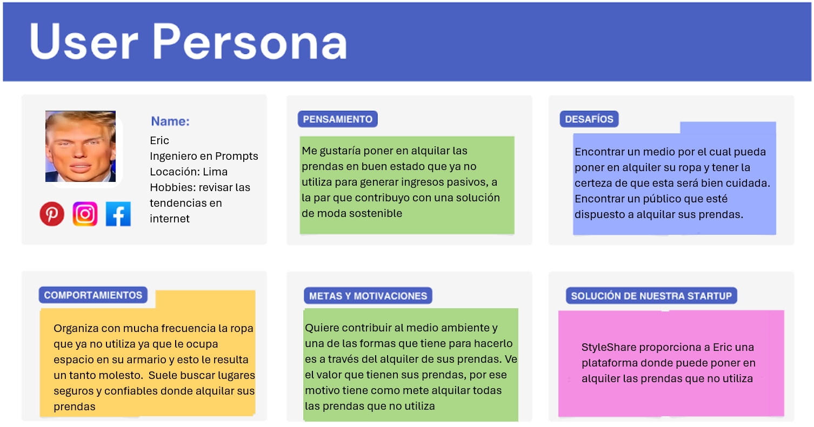

####     2.3.2. User Task Matrix.

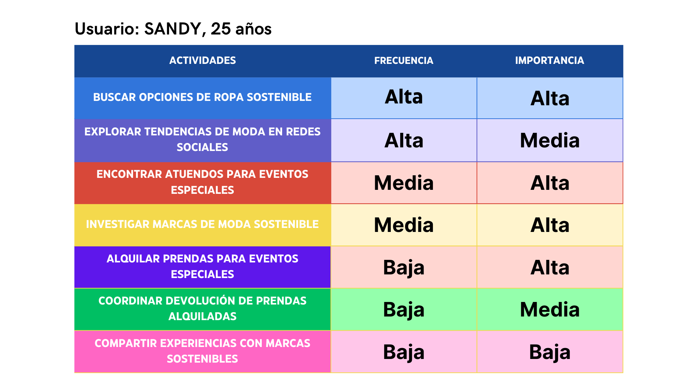

####     2.3.3. User Journey Mapping.

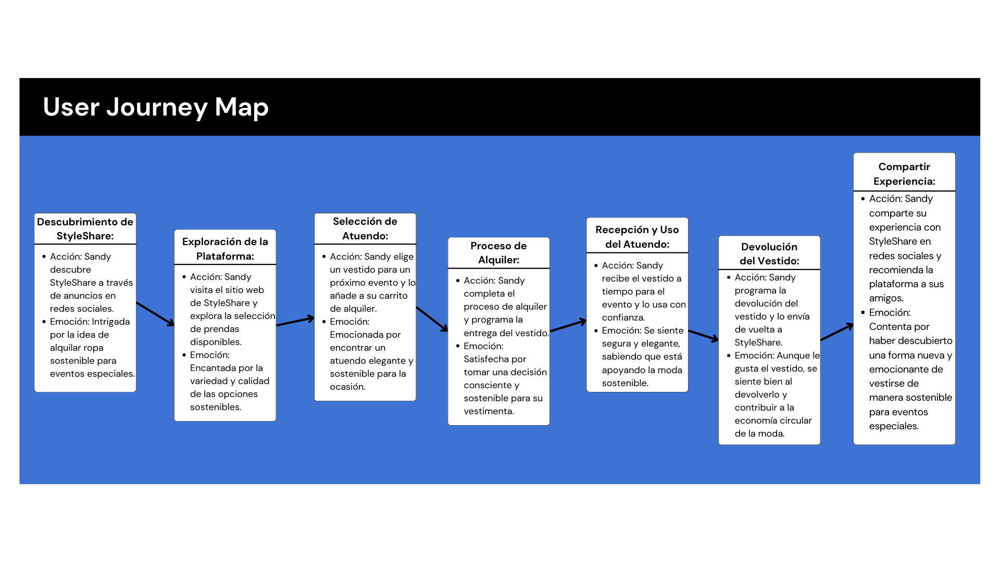

####     2.3.4. Empathy Mapping.

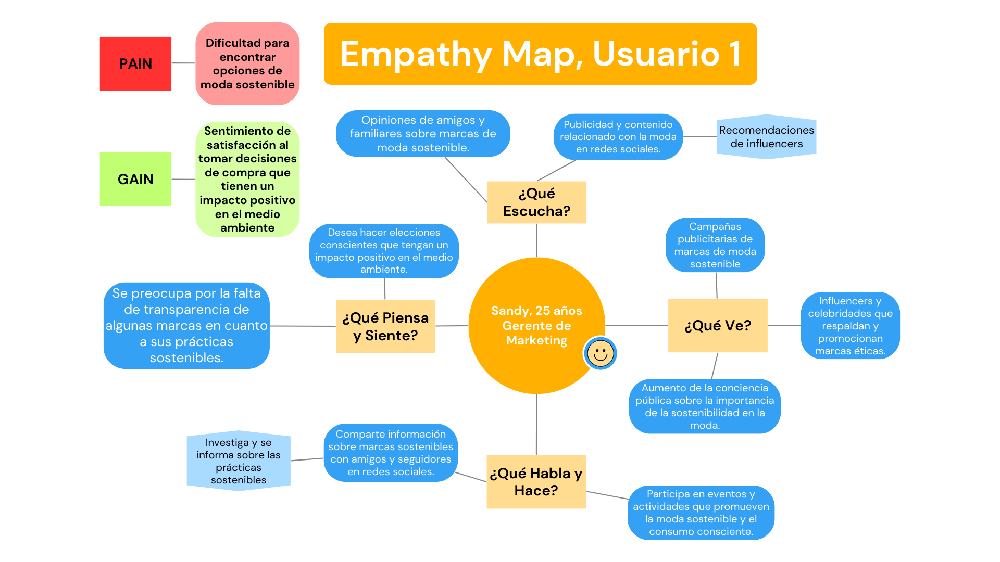

####     2.3.5. As-is Scenario Mapping.

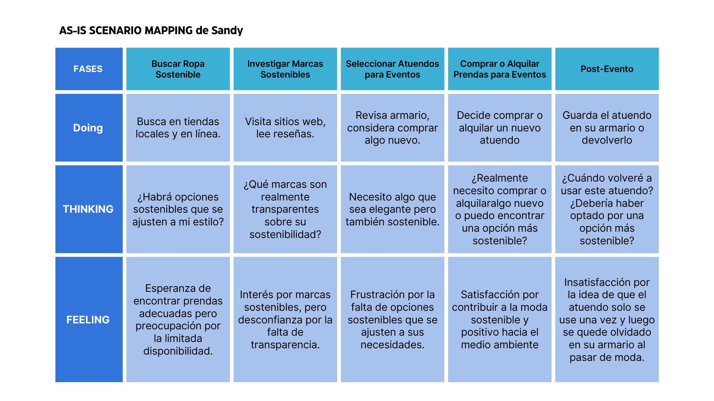

####     2.4. Ubiquitous Language.

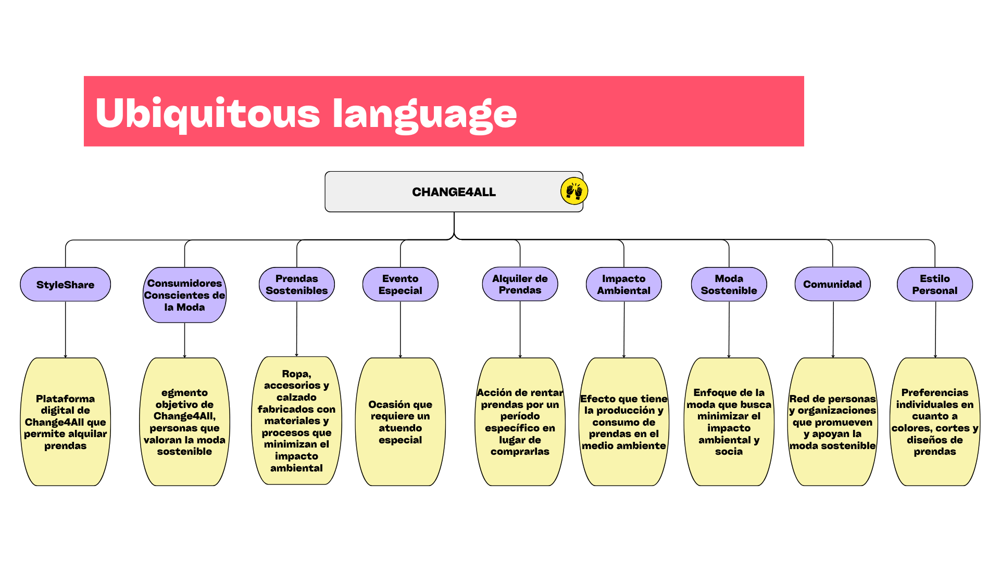


## Capítulo III: Requirements Specification

### 3.1 **To-Be Scenario Mapping.**

#### Segmento 1

| Fase                        | Doing                                                                                                             | Thinking                                                                                                           | Feeling                                                                                             |
|-----------------------------|-------------------------------------------------------------------------------------------------------------------|--------------------------------------------------------------------------------------------------------------------|-----------------------------------------------------------------------------------------------------|
| **Registrarse en StyleShare** | - Me registro desde un dispositivo en la aplicación “StyleShare”.<br> - Relleno los datos solicitados y me creo una cuenta.  |  - El diseño de la interfaz me agrada.<br> - Debo enfocarme en buscar ropa de buena calidad.                           | - Ansiosa por explorar las funciones y opciones que me ofrece la aplicación.                          |
| **Búsqueda de prendas de vestir**   | - Inicio sesión.<br> - Utilizo filtros de búsqueda y las categorías para minimizar la cantidad de productos y ahorrar tiempo.                                            | - La gran variedad de filtros puede ayudar a encontrar lo que quiera de manera mucho más rápida.                   | - Ansiosa por encontrar la ropa que necesito.                                                       |
| **Selección de ropa**               | - Selecciono una prenda de mi interés y veo sus detalles.<br> - Selecciono la opción de compartir con amigos para que puedan darme sus opiniones. - Verifico si el vendedor es confiable mediante su historial de ventas.<br>      | - Debo comprar de los vendedores más destacados para no sufrir pérdidas y obtener buena calidad de ropa.          | - Desesperada por encontrar un vendedor con buenos comentarios.                                       |
| **Finalización de la transacción**  |  - Me decido y realizo el pago, seleccionando el tipo de entrega como delivery.<br> - Concluido el tiempo, devuelvo el traje. | - Ahora puedo usar estilos de ropa variados, pagando un precio menor y ahorrando tiempo.                         | - Alegre por conocer un arrendador fiable en el cual puedo confiar para conseguir más prendas.     |

#### Segmento 2

| Fase                        | Doing                                                                                                             | Thinking                                                                                                           | Feeling                                                                                             |
|-----------------------------|-------------------------------------------------------------------------------------------------------------------|--------------------------------------------------------------------------------------------------------------------|-----------------------------------------------------------------------------------------------------|
| **Registrarse en StyleShare** | - Me registro desde un dispositivo en la aplicación “StyleShare”.<br> - Relleno los datos solicitados y me creo una cuenta.  |  - El diseño de la interfaz me agrada.<br> - Debo enfocarme en publicar prendas que les interese a las personas.                           | -  Ansiosa por explorar las funciones y opciones que me ofrece la aplicación para el alquiler de prendas.                          |
| **Creo una publicación de alquiler**   | - Inicio sesión.<br> - Realizo un pequeño recorrido por la aplicación para ver las publicaciones.<br> - Creo una nueva publicación.                                           | - La gran variedad de categorías me permitirme dirigirme de forma más eficiente a posibles usuarios interesados.                   | - Intrigado por saber el alcance que podrá tener mi publicación.                                                       |
| **Ingreso los datos de la prenda**               | - Completo la publicación con lo datos de mi prenda.<br> - Selecciono el precio por día que considero justo. - Verifico que no haya ningún dato erróneo.<br>      | - Debo colocar información relevante y verídica para que los usuarios no desconfíen de mis publicaciones.          | - Emocionada por hacer mi primera publicación en la página.                                       |
| **Publico la prenda**  |  - Guardo todos los datos y realizo la publicación.<br> - Añado etiquetas correspondientes para que sea más fácil catalogar la prenda. | - Ahora podré tener una pequeña fuente de ingresos a la vez que reutilizo ropa que no uso en buena calidad.                         | - Alegre por la facilidad de hacer una publicación en la aplicación.     |


### 3.2 **User Stories.**


| User Story ID | US01  | Epic ID | EP01  |
|---------------|-------|---------|-------|
| Título        | Registro de usuario |   |
| Descripción   | Como usuario, quiero registrarme en la aplicación web para acceder a todas sus funcionalidades. |   |

**Criterios de aceptación:**

| Escenario 1: Registro de cuenta con Gmail  |
|-------------------------------------------|
| Dado que el usuario se quiere registrar en la web |
| Cuando selecciona la opción “Registrarse” en la pantalla de registros |
| Y ingresa su Gmail personal |
| Y selecciona la opción “Continuar registro” |
| Cuando aparece el nuevo apartado de datos ingresa su información personal, como nombre, zona de residencia, número telefónico y contraseña |
| Entonces la aplicación web registra el usuario y lo redirige a la pantalla principal. |


<br><br>

| User Story ID | US02  | Epic ID | EP01  |
|---------------|-------|---------|-------|
| Título        | Verificación de correo electrónico |   |
| Descripción   | Como usuario, quiero recibir un correo electrónico de verificación después de registrarme. |   |

**Criterios de aceptación:**

| Escenario 1: Verificación de correo electrónico  |
|-------------------------------------------|
| Dado que el nuevo usuario se a registrado |
| Cuando ingreso a su correo electrónico |
| Y revisa la bandeja de entrada |
| Entonces encuentra un correo electrónico de verificación con un enlace para confirmar su dirección de correo electrónico. |

<br><br>                                                                                                                                                                                                                                                                      
| User Story ID | US03  | Epic ID | EP01  |
|---------------|-------|---------|-------|
| Título        | Inicio de sesión |   |
| Descripción   | Como usuario registrado en la aplicación web quiero iniciar sesión en cualquier dispositivo donde esté disponible la aplicación web para usarla en el momento que desee. |   |

**Criterios de aceptación:**

| Escenario 1: Inicio de sesión con correo  |
|-------------------------------------------|
| Dado que el usuario quiere iniciar sesión |
| Cuando ingresa su correo electrónico en la pantalla de inicio de sesión |
| y ingresa la contraseña |
| Y selecciona la opción “Continuar” |
|Entonces la aplicación web lo redirige a la pantalla principal. |

<br><br> 

| User Story ID | US04  | Epic ID | EP01  |
|---------------|-------|---------|-------|
| Título        | Configuración de perfil inicial |   |
| Descripción   | Como usuario, quiero completar mi perfil inicial para proporcionar información relevante. |   |

**Criterios de aceptación:**

| Escenario 1: Configuración de perfil inicial  |
|-------------------------------------------|
| Dado que el usuario se encuentra en la pantalla principal |
| Cuando accede a la pantalla de perfil |
| Y selecciona Editar |
| Entonces la aplicación web guía al usuario para completar campos como nombre, apellidos, foto de perfil, y otra información relevante. |

<br><br> 

| User Story ID | US05  | Epic ID | EP02  |
|---------------|-------|---------|-------|
| Título        | Búsqueda de prendas en la aplicación web |   |
| Descripción   | Como usuario quiero buscar prendas por la app para seleccionar aquellas que se acomoden a mis preferencias. |   |

**Criterios de aceptación:**

| Escenario 1: Ingreso al apartado de prendas de la pantalla principal  |
|-------------------------------------------|
| Dado que el usuario se encuentro en la pantalla principal de la aplicación web |
| Cuando se dirige a una categoría que le muestra la pantalla principal |
| Y da clic al nombre de la categoría |
| Entonces la aplicación muestra una amplia lista con distintos tipos de prendas. |
|-------------------------------------------|
| Escenario 2: Muestra lista de prendas en base a criterios de búsqueda  |
| Dado que el usuario se encuentra en la pantalla principal de la aplicación web |
| Cuando ingresa palabras clave o filtros de búsqueda en el campo de búsqueda |
| Y selecciona inicia la búsqueda |
| Entonces la aplicación web muestra una lista de prendas que coinciden con los criterios de búsqueda del usuario con una pequeña descripción de estos. |

<br><br> 

| User Story ID | US06  | Epic ID | EP02  |
|---------------|-------|---------|-------|
| Título        | Agregar filtros de búsqueda avanzada |   |
| Descripción   | Como usuario quiero tener a mi disposición una serie de filtros para encontrar una prenda de mi interés más rápido. |   |

**Criterios de aceptación:**

| Escenario 1: Acceso a filtro avanzado  |
|-------------------------------------------|
| Dado que el usuario se encuentra en la página principal de la aplicación|
| Cuando selecciona la opción de filtros avanzados en la barra de búsqueda |
| Entonces la aplicación muestra opciones adicionales de filtro, como categoría de prenda, talla, material y precio |
| Cuando completa la información del filtro avanzado con las características que busca |
| Y inicia la búsqueda |
| Entonces la aplicación web muestra una lista de prendas que coinciden con los criterios de búsqueda del usuario. |
|-------------------------------------------|
| Escenario 2: Ingreso de datos erróneas en el filtro avanzado  |
| Dado que el usuario selecciona el filtro avanzado|
| Cuando ingresa datos erróneos en los filtros |
| Y realiza la búsqueda |
| Entonces la aplicación web muestra un mensaje de alerta donde muestra los datos erróneos que se agregaron en el filtro |

<br><br> 

| User Story ID | US07  | Epic ID | EP02  |
|---------------|-------|---------|-------|
| Título        | Exploración de prendas recomendadas |   |
| Descripción   | Como usuario quiero que la aplicación me recomiende nuevas prendas relacionadas a mis intereses y gustos. |   |

**Criterios de aceptación:**

| Escenario 1: Ingresar al apartado de Recomendaciones  |
|-------------------------------------------|
| Dado que el usuario se encuentra en la página principal de la aplicación|
| Y selección el menú desplegable |
| Cuando visualiza al apartado de Productos para ti |
| Y da clic |
| Entonces la aplicación web muestra el apartada de Productos para ti |
|-------------------------------------------|
| Escenario 2: Realizar búsqueda de Prendas recomendadas  |
| Dado que el usuario se encuentra en el apartado de Productos para ti |
| Cuando navega por la sección |
| Entonces la aplicación web muestra una lista de prendas sugeridas basados en los intereses y preferencias del usuario |

<br><br> 

| User Story ID | US08  | Epic ID | EP03  |
|---------------|-------|---------|-------|
| Título        | Ver detalles de la prenda |   |
| Descripción   | Como usuario, quiero poder ver información detallada sobre la prenda que deseo alquilar para obtener todos los detalles relevantes. |   |

**Criterios de aceptación:**

| Escenario 1: Ingresar a ver los datos de la prenda  |
|-------------------------------------------|
| Dado que el usuario se encuentra en la página principal de la aplicación |
| Cuando abre el menú desplegable |
| Y selecciona una categoría de su interés |
| Y selecciona una prenda |
| Entonces la aplicación muestra una pantalla con información detallada sobre la prenda, como nombre, precio, imágenes, comentarios y una descripción en la cual se menciona el material, proceso de fabricación, talla, estilo. |

<br><br>

| User Story ID | US09  | Epic ID | EP03  |
|---------------|-------|---------|-------|
| Título        | Guardar prendas en favoritos |   |
| Descripción   | Como usuario, quiero tener la opción de guardar una prenda en mi lista de favoritos para poder acceder rápidamente a ella en cualquier momento. |   |

**Criterios de aceptación:**

| Escenario 1: Añadir prenda a favoritos  |
|-------------------------------------------|
| Dado que el usuario encontró una prenda de su interés |
| Cuando selecciona la opción de añadir en lista de favoritos |
| Entonces la aplicación guarda la prenda en la sección de favoritos para acceder fácilmente más adelante.|
|-------------------------------------------|
| Escenario 2: Visualizar prendas marcadas como favoritos  |
| Dado que el usuario he agregado una prenda como favorito |
| Cuando se dirijo al apartado de mi perfil en la aplicación web |
| Y da clic en Lista de Favoritos |
| Entonces la aplicación muestra todas las prendas las cuales se han marcado como favoritos. |
|-------------------------------------------|
| Escenario 3: Eliminar prenda favoritos |
| Dado que el usuario quiere eliminar una prenda de favoritos |
| Cuando se dirige al apartado de perfil en la aplicación web |
| Y da clic en Lista de Favoritos |
| Y selecciona la opción eliminar prenda |
| Entonces la aplicación eliminará de Lista de Favoritos la prenda seleccionada. |

<br><br>

| User Story ID | US10  | Epic ID | EP04  |
|---------------|-------|---------|-------|
| Título        | Ver sección de alquiler en la aplicación |   |
| Descripción   | Como usuario, quiero poder acceder al alquiler de cualquier prenda en la aplicación. |   |

**Criterios de aceptación:**

| Escenario 1: Ingreso al apartado de búsqueda de prendas  |
|-------------------------------------------|
| Dado que el usuario se encuentra en la página principal de la aplicación |
| Cuando abre el menú desplegable |
| Y selecciona una categoría de su interés |
| Entonces la aplicación web muestra una amplia lista de prendas. |
|-------------------------------------------|
| Escenario 2: Ingresar a ver los datos de la prenda  |
| Dado que el usuario ve las prendas disponibles en una categoría |
| Cuando selecciona una prenda específica de su interés |
| Entonces la aplicación muestra una pantalla con información detallada sobre la prenda, como nombre, precio, imágenes, comentarios y una descripción en la cual se menciona el material, proceso de fabricación, talla, estilo. |
|-------------------------------------------|
| Escenario 3: Ingresar a la sección alquiler de prenda |
| Dado que el usuario observa los detalles de una prenda y quiere alquilarla |
| Cuando selecciono la opción de alquilar ahora |
| Entonces la aplicación muestra un campo o selector donde puedo seleccionar la cantidad de tiempo que quiere alquilar la prenda |

<br><br>

| User Story ID | US11  | Epic ID | EP04  |
|---------------|-------|---------|-------|
| Título        | Realizar Alquiler de prendas |   |
| Descripción   | Como usuario, quiero poder realizar el alquiler de una prenda por un tiempo determinado para tenerla en mi poder. |   |

**Criterios de aceptación:**

| Escenario 1: Selección de una prenda por un número de días no válidos  |
|-------------------------------------------|
| Dado que el usuario selecciona la cantidad de días que quiere alquilar una prenda |
| Cuando da clic en el botón seguir con el alquiler |
| Entonces la aplicación muestra un mensaje emergente donde indica que la prenda no está disponible para ser alquilada la cantidad de días seleccionadas |
|-------------------------------------------|
| Escenario 2: Mostrar resumen antes de finalizar alquiler  |
| Dado que el usuario selecciona la cantidad días que desea alquilar una prenda |
| y esta listo para realizar la compra |
| Cuando selecciona la opción de confirmar alquiler. |
| Entonces la aplicación muestra un resumen del alquiler, incluyendo la prenda, la cantidad de días y el precio total antes de confirmar el alquiler. |
|-------------------------------------------|
| Escenario 3: Finalizar proceso de alquiler |
| Dado que el usuario verifico la compra visualizando el resumen de compra |
| Y esta conforme con los datos |
| Cuando selecciona la opción de confirmar alquiler |
| Entonces la aplicación procesa la solicitud de alquiler, a la par que registra la transacción. |

<br><br>

| User Story ID | US12  | Epic ID | EP05  |
|---------------|-------|---------|-------|
| Título        | Crear una nueva publicación |   |
| Descripción   | Como usuario quiero tener la posibilidad de publicar las prendas en buen estado que ya no uso en la aplicación para generar algún tipo de ingreso. |  |

**Criterios de aceptación:**

| Escenario 1: Publicación Exitosa  |
|-------------------------------------------|
| Dado que el usuario publicar una prenda |
| Y se encuentra en la pantalla principal |
| Cuando selecciona "Publicar Prenda". |
| Entonces, la aplicación muestra un formulario de publicación que incluye campos para agregar imágenes de la prenda, título, descripción, categoría, talla, estado de la prenda y precio de alquiler. |
| Cuando completa todos los campos requeridos |
| y da clic en el botón "Publicar". |
| Entonces, la aplicación muestra un mensaje de confirmación de que la prenda se ha publicado con éxito. |
|-------------------------------------------|
| Escenario 2: Publicación Incompleta  |
| Dado que el usuario quiere publicar una prenda |
| Y se encuentra en la pantalla principal |
| Cuando selecciona "Publicar Prenda". |
| Entonces la aplicación muestra un formulario de publicación. |
| Cuando el usuario deja campos obligatorios sin completar |
| y da clic en el botón "Publicar". |
| Entonces, la aplicación muestra un mensaje de alerta donde muestra los campos que faltan completar. |
|-------------------------------------------|
| Escenario 3: Cancelación de Publicación |
| Dado que el usuario está en el proceso de crear una nueva publicación |
| Cuando completa algunos de los campos del formulario de publicación |
| Y decide cancelar la publicación en lugar de finalizar. |
| Entonces, la aplicación pregunta si estoy seguro de que quiere cancelar. |

<br><br>

| User Story ID | US13  | Epic ID | EP05  |
|---------------|-------|---------|-------|
| Título        | Visualizar todas mis publicaciones |   |
| Descripción   | Como usuario, quiero poder visualizar mis publicaciones para ver su estado y los comentarios interesados en el producto que ofrezco. |  |

**Criterios de aceptación:**

| Escenario 1: Visualización Exitosa de Publicaciones  |
|-------------------------------------------|
| Dado que el usuario publica varias prendas en alquiler |
| Cuando accede a la sección mi perfil |
| Cuando selecciona "Publicar Prenda". |
| Y selecciona Productos publicados. |
| Cuando completa todos los campos requeridos |
| y da clic en el botón "Publicar". |
| Entonces, la aplicación muestra una lista ordenada de todas las prendas que ha publicado. |
|-------------------------------------------|
| Escenario 2: Acceso a Detalles de Publicación  |
| Dado que el usuario publica varias prendas en alquiler |
| y visualiza la lista de sus publicaciones. |
| Cuando selecciona "Publicar Prenda". |
| Cuando da clic en el elemento de una publicación en la lista. |
| Cuando el usuario deja campos obligatorios sin completar |
| y da clic en el botón "Publicar". |
| Entonces, la aplicación lo redirige a una pantalla que muestra información detallada de esa publicación. |

<br><br>

| User Story ID | US14  | Epic ID | EP06  |
|---------------|-------|---------|-------|
| Título        | Ayuda con problemas en la aplicación |   |
| Descripción   | Como usuario quiero poder ponerme en contacto con servicio al cliente para que me ayuden a resolver cualquier duda o problema que se me presente en la aplicación. |  |

**Criterios de aceptación:**

| Escenario 1: Acceder al servicio de soporte al cliente  |
|-------------------------------------------|
| Dado que el usuario se encuentra navegando por la aplicación web |
| Y tiene una pregunta o un problema mientras usa la aplicación |
| Cuando abre el menú desplegable |
| Y da clic en el icono "Soporte al cliente" |
| Cuando completa todos los campos requeridos |
| Entonces la aplicación muestra la opción de "Realizar Consulta". |
| Entonces, la aplicación muestra una lista ordenada de todas las prendas que ha publicado. |
|-------------------------------------------|
| Escenario 2: Enviar una solicitud de soporte  |
| Dado que el usuario selecciona "Realizar Consulta". |
| Y completa el apartado Asunto y descripción |
| Entonces la aplicación le notificara al usuario cuando el equipo de soporte responda su duda |
|-------------------------------------------|
| Escenario 3: Recibir una respuesta del servicio de soporte  |
| Dado que el usuario envía una solicitud de soporte al cliente |
| Cuando el equipo de soporte recibe la solicitud |
| Entonces la aplicación iniciaría un chat con un personal especializado para que pueda resolver todas mis dudas |

<br><br>

| User Story ID | US15  | Epic ID | EP06  |
|---------------|-------|---------|-------|
| Título        | Asesoramiento sobre moda sostenible |   |
| Descripción   | Como usuario quiero poder tener asesoramiento sobre moda sostenible para saber cómo puedo ayudar al medio ambiente. |  |

**Criterios de aceptación:**

| Escenario 1: Acceder a asesoramiento sobre moda sostenible  |
|-------------------------------------------|
| Dado que el usuario se encuentra navegando por la aplicación web |
| Y tiene una pregunta o un problema mientras usa la aplicación |
| Cuando abre el menú desplegable |
| Y da clic en el icono "Soporte al cliente" |
| Entonces la aplicación muestra la opción de Saber más sobre moda sostenible |
|-------------------------------------------|
| Escenario 2: Obtener recomendaciones personalizadas  |
| Dado que el usuario se encuentra en el apartado Saber más sobre moda sostenible |
| Entonces la aplicación web iniciaría un chat en tiempo real con un asesor capacitado sobre el tema |

<br><br>

| User Story ID | US16  | Epic ID | EP08  |
|---------------|-------|---------|-------|
| Título        | Recopilación de información |   |
| Descripción   | Como consumidor quiero encontrar la información precisa para utilizar la aplicación web. |  |

**Criterios de aceptación:**

| Escenario 1: Acceso al landing page  |
|-------------------------------------------|
| Dado que el esta investigando información |
| Cuando ingreso al landing page de la pagina web |
| Y se dirige a la sección de consumidor casual de la moda |
| Entonces el landing page le mostrara los beneficios que el puede otorgar hacer uso de la pagina web|

<br><br>

| User Story ID | US17  | Epic ID | EP08  |
|---------------|-------|---------|-------|
| Título        | Beneficios al consumidor |   |
| Descripción   | Como arrendador quiero entender los beneficios que me aportara el uso de la página web. |  |

**Criterios de aceptación:**

| Escenario 1: Acceso al landing page  |
|-------------------------------------------|
| Dado que el está investigando los beneficios |
| Cuando ingreso al landing page de la pagina web |
| Y se dirige a la sección de consumidor casual de la moda |
| Entonces el landing page le mostrara los beneficios que él puede otorgar hacer uso de la pagina web |

<br><br>

| User Story ID | US18  | Epic ID | EP07  |
|---------------|-------|---------|-------|
| Título        | Sección “Segmentos” |   |
| Descripción   | Como Asistente a eventos consciente de la moda, quiero entender los beneficios que me aportará el uso de la página web, para poder elegir con conocimiento las opciones que mejorarán mi experiencia en eventos. |  |

**Criterios de aceptación:**

| Escenario:  |
|-------------------------------------------|
| Dado que soy un usuario que accede a la sección "Segmentos" de la página web, |
| Cuando navego por esta sección, |
| Entonces debería ver que el diseño visual (incluyendo colores, tipografías y estilos de imágenes) es coherente con el resto de la página web. |
| Y este diseño debe ser visualmente atractivo y alinearse con las tendencias de moda actuales para apelar a asistentes a eventos de moda. |
| Y todos los elementos visuales deben cargar correctamente sin errores visuales o técnicos. |

<br><br>

| User Story ID | US19  | Epic ID | EP07  |
|---------------|-------|---------|-------|
| Título        | Sección “Nosotros” |   |
| Descripción   | Como visitante interesado en conocer más sobre la empresa, quiero acceder a una sección "Nosotros" clara y bien estructurada para comprender mejor la misión, visión, y valores de la empresa, y así sentir mayor confianza y conexión con la marca. |  |

**Criterios de aceptación:**

| Escenario 1: Accesibilidad y Diseño Responsivo  |
|-------------------------------------------|
| Dado que soy un usuario que visita el sitio web, |
| Cuando accedo a la sección "Nosotros" desde el menú principal o desde un enlace directo en la página de inicio, |
| Entonces debo poder visualizar la página sin problemas de carga y con un diseño que se adapte correctamente a la pantalla de mi dispositivo (ya sea móvil, tablet o escritorio). |
|-------------------------------------------|
| Escenario 2: Contenido Claro y Estructurado con Elementos Interactivos  | 
| Dado que estoy explorando la sección "Nosotros" para obtener más información sobre la empresa, |
| Cuando navego por las subsecciones de historia, misión, visión y valores, |
| Entonces debo encontrar textos claros y bien organizados, así como elementos interactivos (como un video corporativo o un timeline de hitos importantes) que enriquezcan mi comprensión y experiencia. |

<br><br>

| User Story ID | US20  | Epic ID | EP07  |
|---------------|-------|---------|-------|
| Título        | Sección “Header” |   |
| Descripción   | Como usuario del sitio web, quiero que el header sea claro y fácil de navegar, para que pueda encontrar rápidamente la información o sección que busco, lo que me permitirá tener una experiencia de usuario más fluida y satisfactoria. |  |

**Criterios de aceptación:**

| Escenario 1: Visualización de elementos esenciales en el header  |
|-------------------------------------------|
| Dado que estoy navegando en cualquier página del sitio web, |
| Cuando cargo la página, |
| Entonces debo ver claramente el logotipo de la empresa, el menú de navegación principal, y enlaces a las redes sociales o opciones de contacto. |
| Y el logotipo debe estar vinculado a la página de inicio para facilitar el acceso rápido a ella. |
|-------------------------------------------|
| Escenario 2: Funcionalidad de los enlaces del menú  | 
| Dado que deseó navegar a diferentes secciones del sitio a través del header, |
| Cuando hago clic en cualquiera de los enlaces del menú, |
| Entonces cada enlace debe llevarme a la sección correspondiente del sitio sin errores. |
| Y la transición debe ser rápida y sin interrupciones. |

<br><br>

| User Story ID | US21  | Epic ID | EP07  |
|---------------|-------|---------|-------|
| Título        | Sección “Contacto” |   |
| Descripción   | Como usuario que desea obtener más información o resolver dudas específicas, quiero acceder a una sección de contacto clara y fácil de usar, para que pueda comunicarme con la empresa de manera eficiente y sin complicaciones. |  |

**Criterios de aceptación:**

| Escenario 1: Formulario de Contacto Funcional  |
|-------------------------------------------|
| Dado que prefiero enviar un mensaje directo a través del sitio web, |
| Cuando relleno y envío el formulario de contacto, |
| Entonces el formulario debe validar los campos requeridos y enviarse correctamente, confirmándome que mi mensaje ha sido recibido con una notificación o mensaje en pantalla. |

<br><br>

| User Story ID | US22  | Epic ID | EP07  |
|---------------|-------|---------|-------|
| Título        | Sección “Colaboración” |   |
| Descripción   | Como usuario interesado en colaborar con la organización, deseo encontrar una sección en el sitio web dedicada a la colaboración, para que pueda comprender fácilmente cómo puedo contribuir, cuáles son los beneficios y cómo iniciar el proceso. |  |

**Criterios de aceptación:**

| Escenario 1: Contenido Explicativo Completo  |
|-------------------------------------------|
| Dado que estoy interesado en las oportunidades de colaboración, |
| Cuando visite la sección de "Colaboración", |
| Entonces debería encontrar una descripción clara y completa de los diferentes tipos de colaboración que ofrece la empresa (como asociaciones, contribuciones de contenido, patrocinios, o programas de voluntariado). |
|-------------------------------------------|
| Escenario 2: Proceso de Solicitud Claro  | 
| Dado que he decidido aplicar para una colaboración, |
| Cuando desee comenzar el proceso, |
| Entonces debería encontrar un formulario de solicitud o instrucciones claras sobre cómo enviar mi propuesta de colaboración, incluyendo detalles sobre la información y documentos necesarios. |

<br><br>

| User Story ID | US23  | Epic ID | EP07  |
|---------------|-------|---------|-------|
| Título        | Sección “Footer” |   |
| Descripción   | Como usuario del sitio web, quiero que el footer ofrezca accesos directos a información relevante y recursos adicionales para mejorar mi experiencia de navegación y asegurar que encuentro fácilmente lo que necesito. |  |

**Criterios de aceptación:**

| Escenario 1: Inclusión de Elementos Esenciales  |
|-------------------------------------------|
| Dado que busco información esencial al final de la página, |
| Cuando navego al footer del sitio, |
| Entonces debo encontrar enlaces a las páginas de "Política de privacidad", "Términos y condiciones", "Contacto", y "Sobre nosotros". |
|-------------------------------------------|
| Escenario 2: Accesibilidad a Redes Sociales  | 
| Dado que deseo seguir a la empresa en redes sociales, |
| Cuando miro el footer, |
| Entonces debería ver íconos de redes sociales que enlacen directamente a los perfiles oficiales de la empresa en estas plataformas. |
|-------------------------------------------|
| Escenario 3: Navegación Secundaria  | 
| Dado que quiero explorar más contenido sin volver al menú principal, |
| Cuando busco más opciones de navegación, |
| Entonces el footer debería incluir enlaces a otras secciones importantes del sitio web como "Productos", "Servicios", "Eventos" y "Blog". |

<br><br>

| User Story ID | US24  | Epic ID | EP07  |
|---------------|-------|---------|-------|
| Título        | Sección “Inicia Sesión” |   |
| Descripción   | Como usuario del sitio web, quiero que la sección de inicio de sesión sea fácilmente accesible desde cualquier página, para poder acceder rápidamente a mi cuenta y utilizar las funcionalidades relacionadas. |  |

**Criterios de aceptación:**

| Escenario 1: Acceso Rápido  |
|-------------------------------------------|
| Dado que quiero iniciar sesión rápidamente, |
| Cuando busco la sección de inicio de sesión, |
| Entonces debo encontrar un enlace visible en el header o en el footer de la página que me lleve a la página de inicio de sesión. |
|-------------------------------------------|
| Escenario 2: Facilidad de Uso  | 
| Dado que deseo utilizar mi cuenta en diferentes dispositivos, |
| Cuando intento iniciar sesión, |
| Entonces debo poder hacerlo de forma sencilla, con un formulario claro y accesible. |
|-------------------------------------------|
| Escenario 3: Recordar Sesión  | 
| Dado que prefiero no tener que iniciar sesión repetidamente, |
| Cuando utilizo la función "Recordar Sesión", |
| Entonces mi sesión debe mantenerse activa en el dispositivo que estoy utilizando, para que no tenga que volver a iniciar sesión cada vez que accedo al sitio. |

<br><br>

| User Story ID | US25  | Epic ID | EP07  |
|---------------|-------|---------|-------|
| Título        | Sección “Conoce más #1” |   |
| Descripción   | Como usuario, quiero conocer más sobre StyleShare |  |

**Criterios de aceptación:**

| Escenario 1:  |
|-------------------------------------------|
| Dado que un usuario busca información detallada sobre StyleShare, |
| Cuando accede a la sección “Conoce Más” |
| Entonces debe encontrar facilmente la informacion sobre la mision, vision y valores de la empresa |

<br><br>

| User Story ID | US26  | Epic ID | EP07  |
|---------------|-------|---------|-------|
| Título        | Sección “Conoce más #2” |   |
| Descripción   | Como usuario, quiero conocer más sobre los Consumidores y Arrendadores de StyleShare |  |

**Criterios de aceptación:**

| Escenario 1: Acceso Rápido  |
|-------------------------------------------|
| Dado que un usuario quiere conocer mas sobre la comunidad de StyleShare, |
| Cuando accede a la sección “Comunidad” en “Conoce mas” |
| Entonces debe poder ver perfiles de usuario destacados de manera atractiva y facil de navegar |

<br><br>

| User Story ID | US27  | Epic ID | EP07  |
|---------------|-------|---------|-------|
| Título        | Sección “Conoce más #3” |   |
| Descripción   | Como usuario, quiero conocer más sobre Contaminación y Sostenibilidad en la Industria de la Moda |  |

**Criterios de aceptación:**

| Escenario 1: Acceso Rápido  |
|-------------------------------------------|
| Dado que un usuario está interesado en la sostenibilidad en la moda, |
| Cuando accede a la sección “Sostenibilidad” en “Conoce más” |
| Entonces debe encontrar información clara y educativa sobre el impacto ambiental de la industria de la moda |

<br><br>

| User Story ID | US28  | Epic ID | EP04  |
|---------------|-------|---------|-------|
| Título        | Ver carrito de compras|   |
| Descripción   | Como usuario, quiero dirigirme al carrito y revisar los productos agregados |  |

**Criterios de aceptación:**

| Escenario 1: Agregar prenda al carrito de compra  |
|-------------------------------------------|
| Dado que el usuario se encuentra en la pantalla principal de la aplicación web |
| Y selecciona una prenda de su interés |
| Cuando selecciona agregar al carrito |
| Y selecciona el icono del carrito |
| Entonces la aplicación le mostrará todas las prendas que se agregaron |
|-------------------------------------------|
| Escenario 2: Seleccionar prendas del carrito  | 
| Dado que el usuario el usuario se encuentra en el carrito de compra |
| y no quiere comprar todos las prendas que tiene agregadas |
| cuando quita la selección de una prenda de su lista |
| entonces la aplicación no agrega esa prenda al momento de realizar el pago |
|-------------------------------------------|
| Escenario 3: Navegación Secundaria  | 
| Dado que el usuario selecciona todas las prendas de su interés |
| y da clic en pagar ahora |
| Entonces la aplicación lo redirigirá al apartado donde podrá agregar su método de pago y proceder con su compra |


### Epics:

| EP01 : Como usuario quiero tener un registro y configuración del perfil del usuario  |
|--------------------------------------------------------------------------------------|

| EP02 : Como usuario quiero poder buscar la prenda que me interesa.  |
|--------------------------------------------------------------------------------------|

| EP03 : Como usuario quiero obtener información detallada la prenda de mi interés  |
|--------------------------------------------------------------------------------------|

| EP04 : Como usuario quiero poder realizar el alquiler de una prenda  |
|--------------------------------------------------------------------------------------|

| EP05 : Como usuario quiero tener la opción de publicar mis prendas  |
|--------------------------------------------------------------------------------------|

| EP06 : Como usuario, quiero acceso a un servicio de soporte al cliente eficaz  |
|--------------------------------------------------------------------------------------|

| EP07 : Como usuario, quiero visitar el landing page de la pagina web  |
|--------------------------------------------------------------------------------------|

|--------------------------------------------------------------------------------------------------------|


### 3.3. **Impact Mapping.**

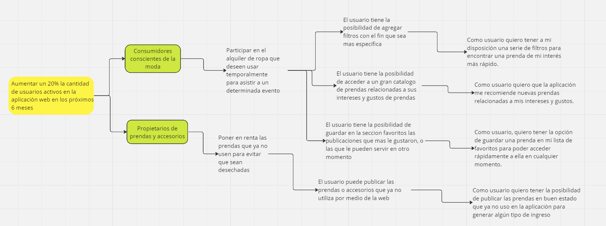

### 3.4 **Product Backlog.**
|Orden|User Story ID|Título|Descripción|Story Points|
|-----|-------------|------|-----------|------------|
|1|US04|Configuración de perfil inicial|Como usuario, quiero completar mi perfil inicial para proporcionar información relevante.|3|
|2|US07|Exploración de prendas recomendadas|Como usuario quiero que la aplicación me recomiende nuevas prendas relacionadas a mis intereses y gustos.|3|
|3|US28| Ver carrito de compras|Como usuario, quiero dirigirme al carrito y revisar los productos agregados |5|
|4|US13 |Visualizar todas mis publicaciones |Como usuario, quiero poder visualizar mis publicaciones para ver su estado y los comentarios interesados en el producto que ofrezco |3|
|5|US08|Ver detalles de la prenda|Como usuario, quiero poder ver información detallada sobre la prenda que deseo alquilar para obtener todos los detalles relevantes.|5|
|6|US14|Ayuda con problemas en la aplicación|Como usuario quiero poder ponerme en contacto con servicio al cliente para que me ayuden a resolver cualquier duda o problema que se me presente en la aplicación.|3|


## Capítulo IV: Product Design
### 4.1. **Style Guidelines.**
####     4.1.1. General Style Guidelines.
Branding
Utilizamos un enfoque amigable, elegante y sencillo para nuestro Branding, con el cual buscamos transmitir confianza, seguridad y seriedad en el alquiler de prendas. 


Tipografía: Nuestra fuente principal es Raleway, la cual garantiza legibilidad en todos los dispositivos y tamaños de pantalla, aparte mantener el uso de una sola fuente  mandate orden y uniformidad en toda la aplicación web.

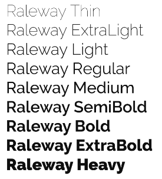

Colores: Utilizamos colores de tonalidades amarillo, verde y azul ya que queremos transmitir entusiasmos, bienestar, honestidad y seguridad a nuestro usuarios, asimos estos tienen una tonalidad oscura con el fin de mostrar una aplicación más elegante y estable.

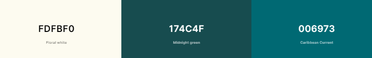

Espacio: Se establecen márgenes y espacios uniformes en toda la aplicación para garantizar una experiencia ordenada y limpia sin sobrecargar su visión.
 
Tono de comunicación: Esta es amigable y accesible pero profesional y confía al mismo tiempo, por otra parte, se mantiene el tono respetuoso hacia los usuarios a la par que refleja creatividad.

####    4.1.2. Web Style Guidelines.
Nuestra interfaz web será responsiva, de adaptarse de manera fluida a diferentes tamaños de pantalla, garantizando una experiencia agradable al usuario Las imágenes juegan un papel fundamental en nuestra página web, por eso se usarán imágenes de alta resolución para mostrar las prendas y productos de manera más llamativa y atractiva, asimismo se emplearán iconos claros con los cuales el usuario podrá desplazarse por toda la aplicación En la navegación del usuario la aplicación se mantendrá simple e intuitiva con los iconos de navegación, búsquedas visibles y accesibles, además, tanto el proceso de alquiler y publicación de prendas de simplificará al máximo, con pasos claros y una interfaz amigable.

### 4.2. **Information Architecture.**
####    4.2.1. Organization Systems.
 ### Cada prenda de ropa a alquilar tendrá una pequeña ventana donde se muestra información básica como su nombre, precio y calificación, junto a una imagen.
 ### Al buscar se mostrarán en orden alfabético, o de más nueva según el usuario elija.
 ### En la pantalla principal las ventanas vendrán acomodadas en filas para exhibir recomendaciones, a los vendedores más nuevos, y una fila para cada tipo de ropa, en orden alfabético.
 ### En la parte superior se mostrará información del usuario, junto con las membresías que posea.
 ### En la ventana de añadir prenda, deberá ingresar imágenes, un precio y una descripción para su producto.

####    4.2.2. Labeling Systems.
Ingresar sesión/registrarse: En la esquina superior izquierda se mostrará el botón para ingresar su cuenta o crearla.

Usuario: En la esquina súper izquierda, si se hace clic en ella se accederá a una ventana donde se visualizará la información del usuario.

Buscar: En la parte superior, al tocarlo se abrirá el buscador junto con las opciones para buscar.

Mis prendas: En la esquina superior izquierda: Al tocarla se mostrarán las prendas que el usuario tiene en alquiler, junto con su información.

Añadir prenda: En la esquina inferior derecha habrá un botón para poner en renta una prenda de tu propiedad.

####    4.2.3. SEO Tags and Meta Tags.
**Titulo:**

```
<Title>Register your processes with StyleShare</Title>
```

**Codificación de carácteres:**

```
<meta charset="utf-8">
```

**Descripción:**

```
<meta name="description" content="We offer you the opportunity to rent high-quality clothing, accessories and footwear for specific periods, so you feel amazing every time without compromising your style or budget."/>
```

**Palabras Claves:**

```
<meta name="keywords" content="fashion, innovative, rent, economic, flexibility"/>>
```

**Autor y Derechos de Autor:**

```
<meta name="author" content="StyleShare"/>

<meta name="copyright" content="Copyright StyleShare team" />
```

####    4.2.4. Searching Systems.
Al buscar, se puede elegir el tipo de vestimenta deseada, además de elegir entre un rango de precios. Se contará con un auto corrector para buscar el nombre del arrendador o de la vestimenta. Los resultados se mostrarán según orden de novedad, mejor calificados o alfabéticos según la elección del usuario.

####    4.2.5. Navigation Systems.
El usuario se moverá entre distintas pantallas usando los botones presentas en la parte superior del menú principal. Desde los cuales podrá ir a una ventana con las ropas ya alquiladas, a un buscador para ver las vestimentas disponibles y arrendadores, y la información personal de usuario junto con la membresía que tiene. Además, en la esquina inferior derecha encontrará un botón que lo llevará al menú para poner en renta una prenda.

### 4.3. **Landing Page UI Design.**
####    4.3.1. Landing Page Wireframe.
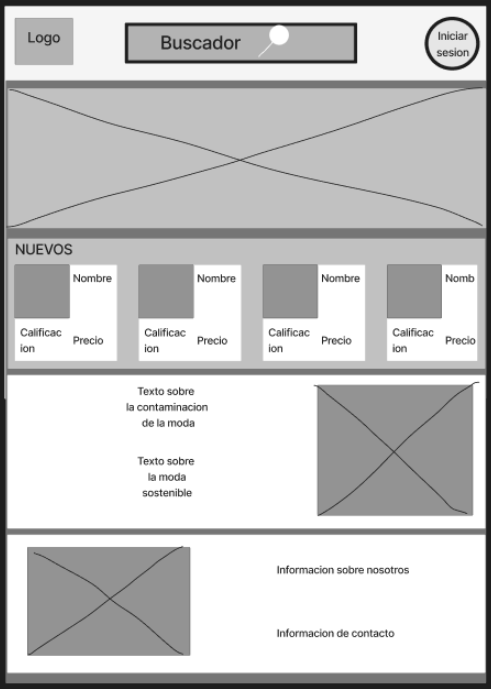

####    4.3.2. Landing Page Mock-up.
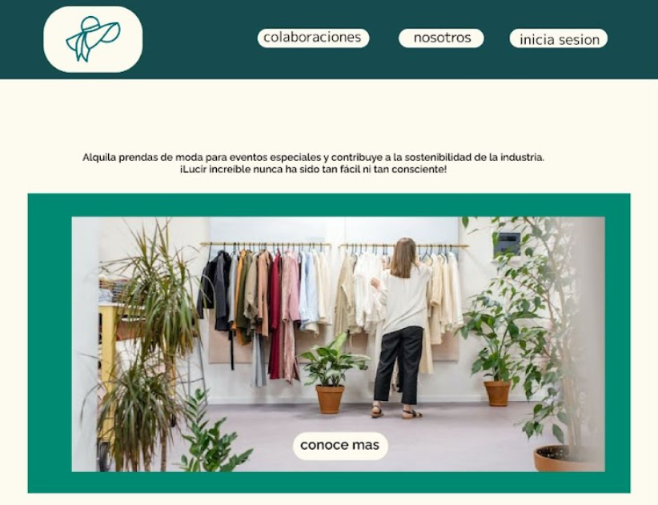
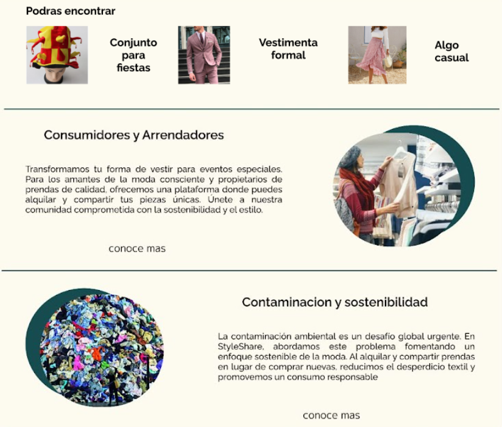
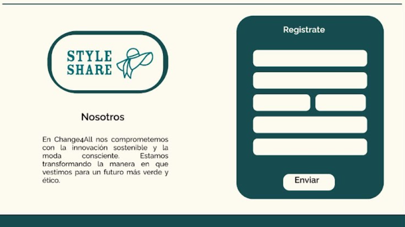

### 4.4. **Web Applications UX/UI Design.**
####    4.4.1. Web Applications Wireframes.


####    4.4.2.. Web Applications Wireflow Diagrams.
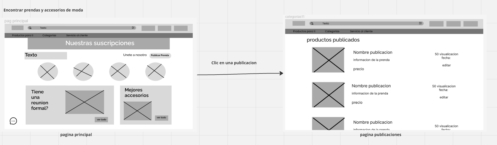
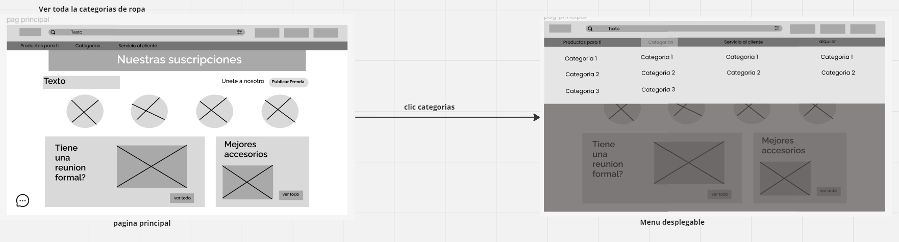
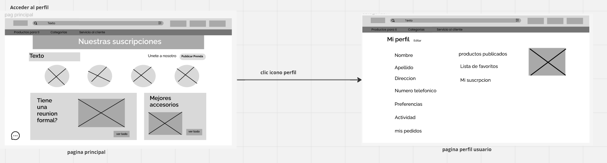
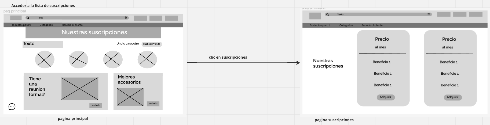
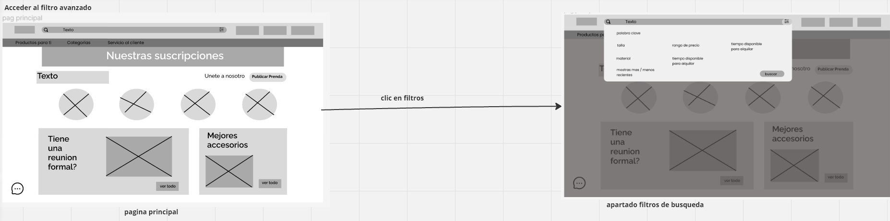
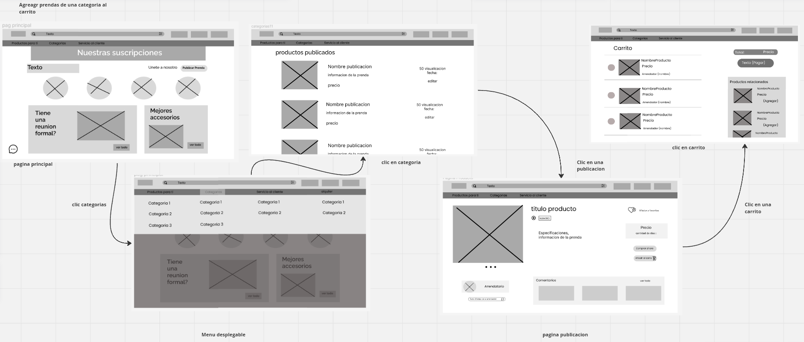
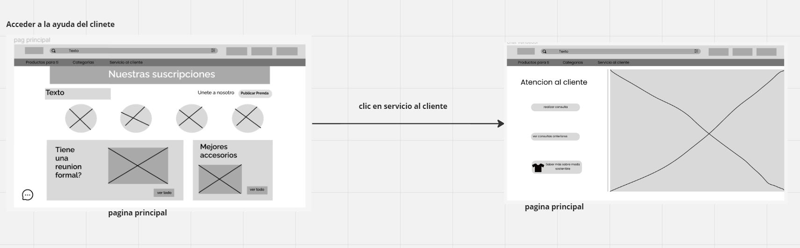

####    4.4.2. Web Applications Mock-ups.


####    4.4.3. Web Applications User Flow Diagrams.
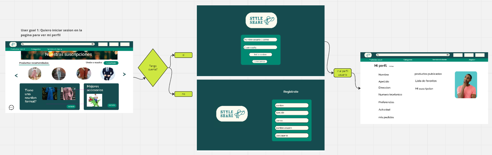
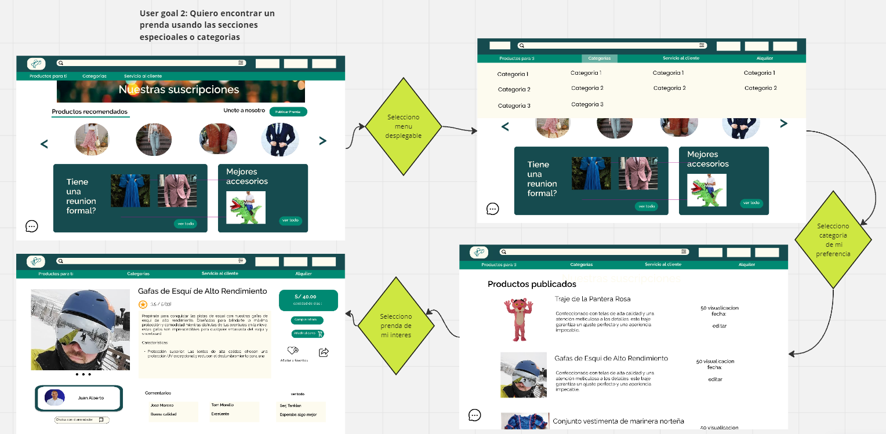
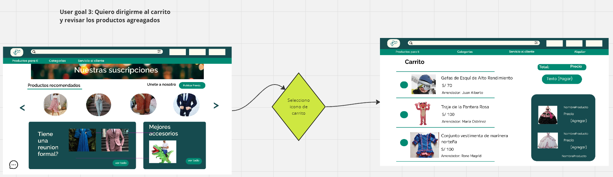
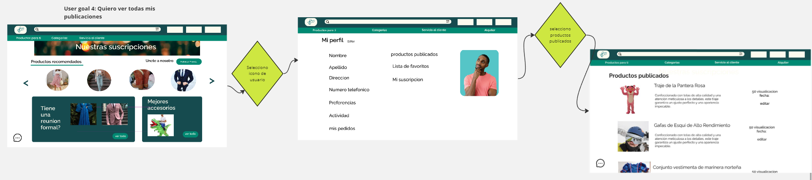
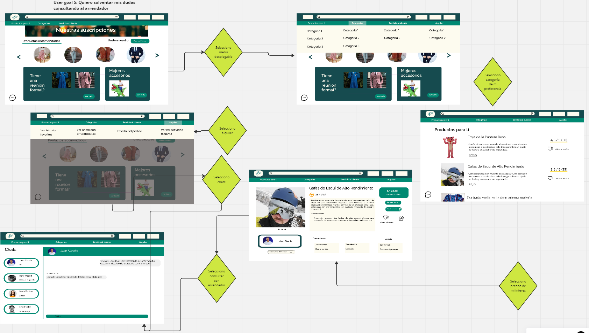
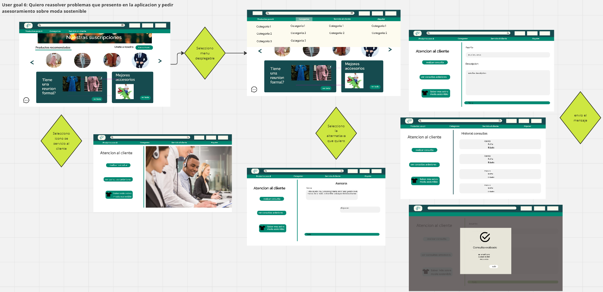

[**Miro Users Goals Web Application**](https://miro.com/app/board/uXjVKWB7Y98=/)

### 4.5 **Web Applications Prototyping.**
[**Figma Web Application**](https://www.figma.com/proto/7Mp7dcTqoQm2soCJln7Hmv/StyleShare?type=design&node-id=4644-2&t=4TceG8kvgTzI5J0p-1&scaling=min-zoom&page-id=10%3A2&starting-point-node-id=4644%3A2)

### 4.6. **Domain-Driven Software Architecture.**
####    4.6.1. Software Architecture Context Diagram.
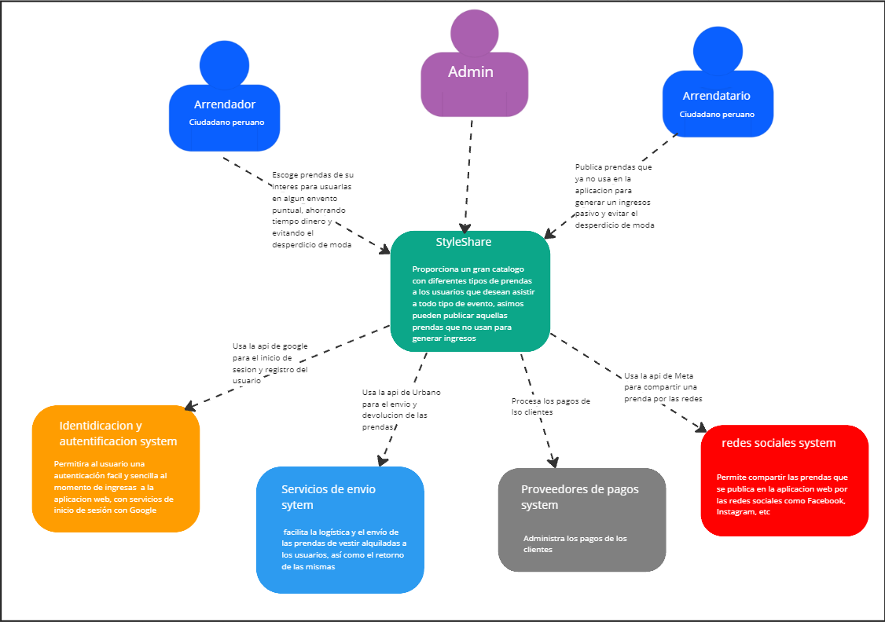

####    4.6.2. Software Architecture Container Diagrams.
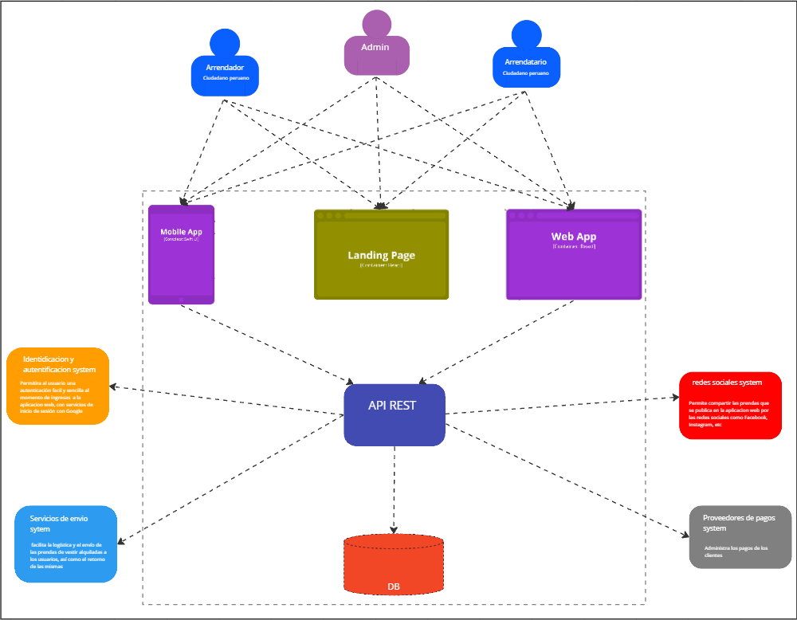

####    4.6.3. Software Architecture Components Diagrams.
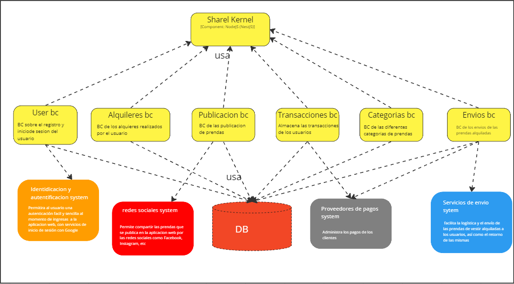

[**Miro Domain-Driven Software Architecture**](https://miro.com/app/board/uXjVKXvlnKw=/)

### 4.7. **Software Object-Oriented Design.**
####    4.7.1. Class Diagrams.
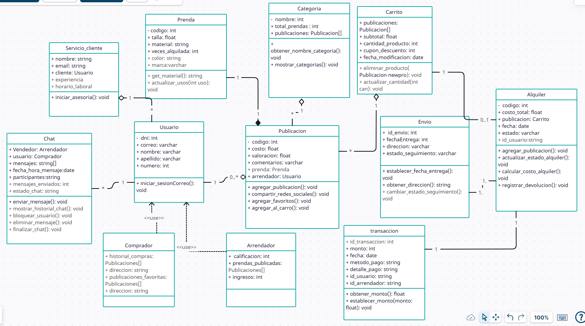

####    4.7.2. Class Dictionary.
Class Transacción
<br><br>
| Atributo         | Type       |Description|
|------------------|------------|-----------|
| monto           | int     | Representa el monto de la transacción. |
| estado           | string     | Estado de la transaccion |
| fecha           | date     | Fecha en la que se realizo la transaccion. |

| Funcion         | Type       |Description|
|------------------|------------|-----------|
| obtener_monto()           | float     | Devuelve el monto de la transacción como un número de punto flotante. |
| establecer_monto(monto)         | float      |  Establece el monto de la transacción.|

<br><br>

Class Categoría

| Atributo       | Type | Description                                         |
|----------------|------|-----------------------------------------------------|
| nombre         | int  | Almacena el nombre de la categoría.                |
| totalPrendas  | int  | Almacena el número total de prendas en la categoría.|

| Función                       | Type | Description                                       |
|-------------------------------|------|---------------------------------------------------|
| obtener_nombre_categoría()    | void | Devuelve el nombre de la categoría.               |
| mostrar_categorías()          | void | Muestra las categorías disponibles.               |

<br><br>

Class Suscripción

| Atributo      | Type    | Description                                    |
|---------------|---------|------------------------------------------------|
| tipo          | int     | Almacena el tipo de suscripción.              |
| costo         | float   | Almacena el costo de la suscripción.          |
| descripción   | varchar | Almacena una descripción de la suscripción.   |

| Función               | Type | Description                                       |
|-----------------------|------|---------------------------------------------------|
| generar_sub(usuario)  | void | Genera una suscripción para un usuario.           |
| cambiar_sub(usuario)  | void | Cambia la suscripción de un usuario.              |
| cancelar_sub(usuario) | void | Cancela la suscripción de un usuario.             |

<br><br>

Class Publicacion

| Atributo      | Type    | Description                                            |
|---------------|---------|--------------------------------------------------------|
| código        | int     | Almacena el código de la publicación.                  |
| costo         | float   | Almacena el costo de alquiler de la prenda.            |
| valoración    | float   | Almacena la valoración de la publicación.              |
| comentarios   | varchar | Almacena los comentarios de la publicación.            |
| arrendador    | Usuario | Almacena el usuario que publicó la prenda.             |
| prenda        | Prenda  | Almacena la prenda que se publica.                     |

| Función                        | Type | Description                                                  |
|--------------------------------|------|--------------------------------------------------------------|
| agregar_publicación()          | void | Agrega una nueva publicación.                                |
| compartir_redes_sociales()     | void | Comparte la publicación en redes sociales.                   |
| agregar_favoritos()            | void | Agrega la publicación a los favoritos del usuario.           |
| agregar_al_carro()             | void | Agrega la publicación al carrito de compras.                 |

<br><br>

Class Usuario

| Atributo       | Type      | Description                                            |
|----------------|-----------|--------------------------------------------------------|
| dni            | int       | Almacena el DNI del usuario.                           |
| correo         | varchar   | Almacena el correo electrónico del usuario.            |
| nombre         | varchar   | Almacena el nombre del usuario.                        |
| apellido       | varchar   | Almacena el apellido del usuario.                      |
| número         | int       | Almacena el número de teléfono del usuario.            |
| suscripción    | Suscripción | Almacena la suscripción del usuario.                  |

| Función                    | Type  | Description                                            |
|----------------------------|-------|--------------------------------------------------------|
| iniciar_sesiónCorreo()     | void  | Inicia sesión del usuario con su correo electrónico.  |
| iniciar_sesiónGoogle()     | void  | Inicia sesión del usuario con su cuenta de Google.     |

<br><br>

Class Alquiler

| Atributo            | Type       | Description                                            |
|---------------------|------------|--------------------------------------------------------|
| código              | int        | Almacena el código del alquiler.                       |
| costo_total         | float      | Almacena el costo total del alquiler.                  |
| publicación         | Publicación | Almacena la publicación del alquiler.                  |
| fecha               | date       | Almacena la fecha de inicio del alquiler.              |
| estado              | varchar    | Almacena el estado del alquiler.                       |
| prenda              | Prenda     | Almacena la prenda alquilada.                          |

| Función                            | Type  | Description                                            |
|------------------------------------|-------|--------------------------------------------------------|
| agregar_publicación()              | void  | Agrega una nueva publicación.                          |
| actualizar_estado_alquiler()       | void  | Actualiza el estado del alquiler.                      |
| calcular_costo_alquiler()          | void  | Calcula el costo total del alquiler.                   |
| registrar_devolución()             | void  | Registra la devolución de la prenda.                   |

<br><br>

Class Envio

| Atributo             | Type    | Description                                        |
|----------------------|---------|----------------------------------------------------|
| fechaEntrega         | int     | Almacena la fecha de entrega del envío.            |
| dirección            | varchar | Almacena la dirección de entrega del envío.        |
| estadoSeguimiento    | varchar | Almacena el estado de seguimiento del envío.       |

| Función                                | Type  | Description                                        |
|----------------------------------------|-------|----------------------------------------------------|
| establecer_fecha_entrega()             | void  | Establece la fecha de entrega del envío.           |
| obtener_dirección()                    | string| Obtiene la dirección de entrega del envío.        |
| cambiar_estado_seguimiento()           | void  | Cambia el estado de seguimiento del envío.        |

<br><br>

### 4.8. **Database Design.**
####    4.8.1. Database Diagram.
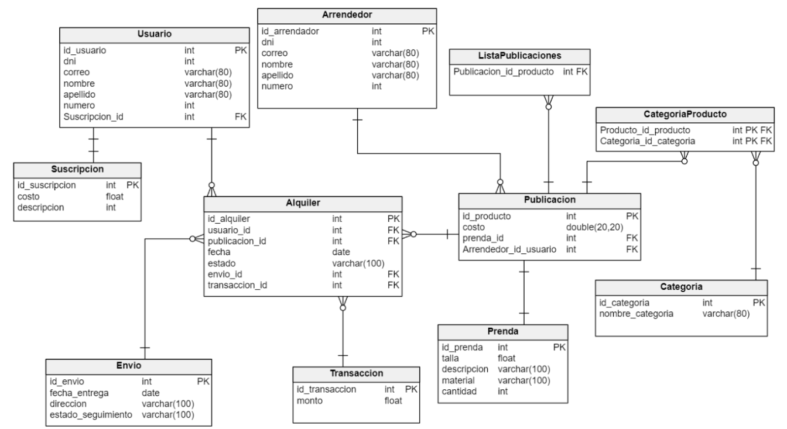


## Capítulo V: Product Implementation, Validation & Deployment
### 5.1. Software Configuration Management.
####    5.1.1. Software Development Environment Configuration.

Project Management:

WhatsApp: Aplicación de mensajería por dónde nos comunicamos para coordinar las tareas a realizar https://www.whatsapp.com/?lang=es_LA

Notion: Notion es una herramienta de gestión de proyectos que permite a los equipos colaborar en tiempo real, organizar tareas y compartir información de manera eficiente. https://www.notion.so/es-es


Requirements Management:

Google Drive: Plataforma para almacenar archivos, en la cual se guardaron videos de las entrevistas y documentos que se utilizaron en la creación del informe. 
https://drive.google.com/

Product UX/UI Design:

Figma: Herramienta para diseñar interfaces, la cual se utilizó para crear los wireframes y mockups de nuestro servicio https://www.figma.com/

Git Hub: Plataforma para desarrollo de software, en la cual se almacenaron archivos del proyecto. https://github.com/


Software Development:

Visual Studio Code: Visual Studio Code es un editor de código ligero y altamente personalizable que ofrece una amplia gama de funciones y extensiones para facilitar el desarrollo de software. https://code.visualstudio.com/

Miro: Espacio de trabajo para crear distintos tipos de archivos, el cuál se usó para crear diagramas https://miro.com/es/

HTML: HTML es el lenguaje de marcado estándar utilizado para crear y diseñar páginas web. En StyleShare, utilizamos HTML para estructurar y organizar el contenido de nuestra aplicación web, lo que nos permite definir la jerarquía de los elementos y la presentación visual de la interfaz de usuario. https://developer.mozilla.org/en-US/docs/Web/HTML

CSS: CSS es un lenguaje de diseño utilizado para definir la apariencia y el estilo visual de las páginas web. En StyleShare, utilizamos CSS para personalizar y dar formato al contenido de nuestra aplicación web, lo que nos permite controlar la tipografía, los colores, los márgenes y otros aspectos visuales de la interfaz de usuario. https://developer.mozilla.org/en-US/docs/Web/CSS


Javascript: JavaScript es un lenguaje de programación utilizado en el desarrollo web para crear páginas interactivas y dinámicas. 
https://developer.mozilla.org/en-US/docs/Web/JavaScript

Git: Git es un sistema de control de versiones distribuido que permite a los equipos colaborar en el desarrollo de software, realizar un seguimiento de los cambios en el código y gestionar las versiones de los archivos de forma eficiente. https://git-scm.com/


Software Documentation and Project Management

Github: GitHub es una plataforma en línea que permite a los equipos colaborar en el desarrollo de software, alojar repositorios de código y gestionar proyectos de forma eficiente. 

####    5.1.2. Source Code Management.

|Integrantes| Cuenta de GitHub      |
|----------|-----------------------|
|Agama Espinoza, Eric Fabrizio	| U202213358@upc.edu.pe |
|Ramos Najar Tony Alexander| u20211A153@upc.edu.pe |
|More Rondon Christopher Sebastian| u202212199@upc.edu.pe |
|Cortez Quezada, Joaquin Antonio	| u202212648@upc.edu.pe |

Despliegues:

https://upc-pre-202401-si730-ws51-styleshare.github.io/LandingPage/

Repositorios:

https://github.com/upc-pre-202401-SI730-WS51-StyleShare/LandingPage

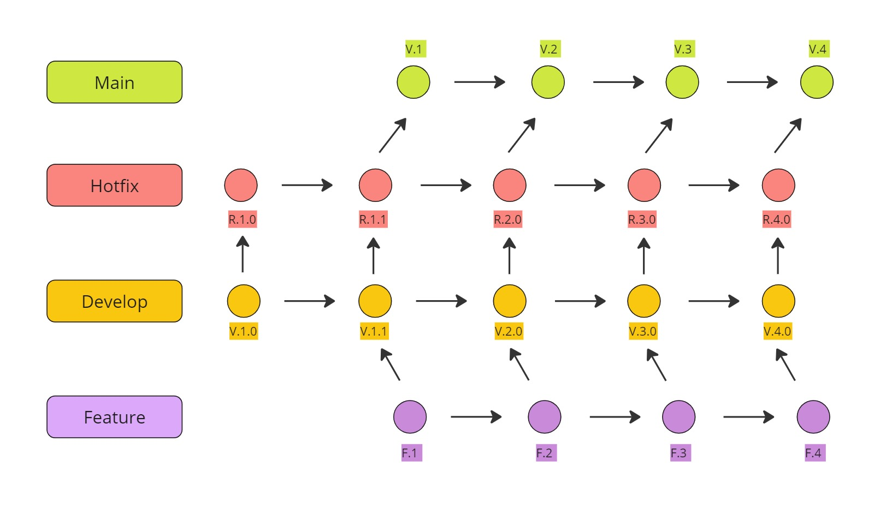

El modelo de Gitflow define una serie de ramas estándar y reglas para su uso, lo que facilita la colaboración y la gestión del código en un equipo de desarrollo.

La rama main es la rama principal de nuestro proyecto, que contiene la versión estables, operativas y listas para implementar. Usaremos etiquetas para marcar cada versión estable y desplegable, esto nos permitirá realizar un seguimiento claro de las versiones y facilitar la gestión de futuras actualizaciones.

La rama develop es la rama de desarrollo contiene las versiones en desarrollo de nuestro proyecto que aún no han sido sometidas a pruebas, aunque están completadas y contienen todas las características que se esperan hasta ese momento.

La rama feature es la rama donde cada nueva característica se desarrolla en una rama de características separada, lo que permite a los miembros del equipo trabajar de forma independiente en diferentes aspectos de la aplicación

####    5.1.3. Source Code Style Guide & Conventions.

En esta sección, se establece y documenta la guía de estilo y las convenciones de codificación que deben seguirse en el proyecto.Estas convenciones se aplicarán a los diversos lenguajes utilizados como HTML,CSS y Gherkin.

#### HTML: 

Se debe cerrar cada elemento HTML adecuadamente.

Utilizar minúsculas para los nombres de elementos y atributos.

Emplear comillas alrededor de los valores de los atributos, especialmente cuando incluyan espacios.

#### CSS: 

Todo el código debe estar en minúscula. 

Utilizar nombres de clase significativos o genéricos, nombres que reflejen el propósito de su elemento.

Evitar especificar la unidad de medida para valores de 0.

#### JavaScript:

Utilizar nombres de variables y funciones descriptivos

Mantener comentarios para explicar el propósito y la funcionalidad del código

Utilizar punto y coma al final de cada declaración

#### Gherkin:

Utilizar los bloques Given, When, y Then para estructurar los escenarios

Utilizar palabras clave significativas y descriptivas.

Usar saltos de línea para mejorar la legibilidad y agrupar información.

####    5.1.4. Software Deployment Configuration.
En este trabajo utilizaremos Git y Github

Git: Git es un sistema de control de versiones distribuido muy utilizado en el desarrollo de software. Ha evolucionado hasta convertirse en una herramienta esencial para la colaboración y el seguimiento de cambios en proyectos, tanto de código abierto como privados. Los desarrolladores pueden crear ramas, realizar modificaciones en estas y fusionarlas de manera eficiente, permitiendo así el trabajo simultáneo.

Su utilidad reside en el control detallado de las herramientas del software, permitiendo almacenar diferentes versiones a lo largo de las distintas etapas del proyecto. Esto posibilita a los desarrolladores hacer un seguimiento de lo realizado y resolver problemas o realizar cambios según sea necesario durante el desarrollo del proyecto.

GitHub: GitHub es una plataforma de alojamiento y colaboración de código fuente construida sobre Git. En este entorno, los desarrolladores pueden crear repositorios para almacenar y administrar su código fuente, los cuales pueden ser públicos o privados. 

GitHub permite que múltiples desarrolladores trabajen simultáneamente en el mismo repositorio, realizando cambios en diferentes ramas y fusionándose de manera sencilla. Esto simplifica la gestión conjunta y la integración de contribuciones diversas.

### 5.2. Landing Page, Services & Applications Implementation.
####    5.2.1. Sprint 1
#####         **5.2.1.1. Sprint Planning 1.**
| Sprint 1                         | Implementación de funcionalidades y diseño de la aplicación.|
| -------------------------------- | ----------------------------------------------------------- |
| Sprint Planning Background       |
| Date                             | 10/04/2024|
| Time                             | 22:00 horas (GMT-5)|
| Location                         | Reunión realizada mediante Discord|
| Prepared By                      | Cortez Quezada, Joaquin Antonio	|
| PAttendees (to planning meeting) | <li>Cortez Quezada, Joaquin Antonio</li>	 <li>More Rondon Christopher Sebastian </li> <li>Agama Espinoza, Eric Fabrizio   </li> <li>Ramos Najar Tony Alexander </li>|
|Sprint n -1 Review|
|Resumen|Se creará la organización de StyleShare en Github y el repositorio de la organización. |
|Sprint n -1 Retrospective|
|Resumen|Se implemento para el landing se ha realizado mediante html css y js.|
| **Sprint Goal & User Stories**   |
| Sprint 1 Velocity                |  21 points|
| Sum of Story Points              |  21 points|

#####         **5.2.1.2. Sprint Backlog 1.**
| id   | Title                  | Id  | Title                                                    | Description                                                                                                   | Estimations(Hours) | Assigned To   | Status(To-do /InProcess/ToReview/Done) |
| ---- | ---------------------- | --- | -------------------------------------------------------- | ------------------------------------------------------------------------------------------------------------- | ------------------ | ------------- | -------------------------------------- |
| GW01 | Apartado del Header  | G01 | Header responsivos (Desarrollado en HTML y CSS).| Desarrollo e implementación de los estilos que corresponden al encabezado (Header). Debe ser responsive.      | 3| Joaquin Antonio  | Done|
| GW02 | Apartado del Footer    | G02 | Footer responsivos (Desarrollado en HTML y CSS).| Desarrollo e implementación de los estilos que corresponden al pie de página (Footer). Debe ser responsive.   | 2| Christopher Sebastian | Done|
| GW03 | Apartado Nosotros          | G03 | Nosotros (Desarrollado en HTML y CSS)| Desarrollo e implementación de descripcion sobre nosotros. Debe ser responsive.           | 3|  Christopher Sebastian  | Done|
| GW04 | Apartado Colaboraciones   | G04 | (Desarrollado en HTML y CSS)| Desarrollo e implementación de los estilos que corresponden a Producto. Debe ser responsive.    | 2| Tony Alexander   | Done|
| GW05 | Apartado formulario          | G05 | Sección formulario (Desarrollado en HTML y CSS)| Desarrollo e implementación de los formularios. Debe ser responsive.    | 3|  Joaquin Antonio  | Done|
| GW06 | Implementacin de Javascript | G06 | Implementacin de Javascript (Desarrollado en HTML y JS)| Desarrollo e implementación de animaciones. Debe ser responsive. | 3| Eric Agama | Done|
| GW07 | Incio de sesion     | G07 | Funcionalidad de los Botones(Desarrollado en HTML y CSS) | Desarrollo e implementación de los estilos que corresponden a los planes de la página. Debe ser responsive.  | 3| Tony Alexander | Done|
| GW08 | Apartado encabezado    | G08 | Desarrollo responsive de la página| Desarrollo e implementación de un estilo responsive en toda la página.| 2| Eric Agama  | Done|

#####         **5.2.1.3. Development Evidence for Sprint Review.**
| Repository   | Branch                                      | Commit Id | Commit Message                   | Commit Message Body | Commited on (Date) |
| ------------ | ------------------------------------------- | --------- | -------------------------------- | ------------------- | ------------------ |
| LandingPage |main/sign_in.html |55064b6| Create sign_in.html| -| 12/04/2024         |
| LandingPage |main/style/style.css|425cbfc| Add files via upload| -| 13/04/2024|
| LandingPage |main/Collaboration.html|7cc0929| Add files via upload| -| 12/04/2024|
| LandingPage |main/scripts/script.js |9391f88| Implementacion de javascript | -| 14/04/2024|
| LandingPage |main/style/style3.css|cdccf9b| Implementacion css sign_in | -|14/04/2024|
| LandingPage |main/style/style2.css|d785cfd| Style Colaboraciones | -|14/04/2024|
| LandingPage |main/sign_in.html |889bdaa| Update sign_in css | -|14/04/2024|
| LandingPage |main/Collaboration.html|a40b0ac|Update Collaboration implement css| -|14/04/2024|


#####         **5.2.1.4. Testing Suite Evidence for Sprint Review.**

Para la entrega del Sprint 1 se intentó alcanzar el desarrollo completo, implementación y despliegue del Landing Page. Es por ello que la sección de "feature" se centro en la implementación de los archivos feature que contiene nuestro landing page.


#####         **5.2.1.5. Execution Evidence for Sprint Review.**

En el sprint 1 se alcanzó un desarrollo parcial en la implementación del despliegue del landing page. La cual muestra diferentes secciones donde el usuario puede encontrar información relevante acerca del producto y del start up.

Sección home:

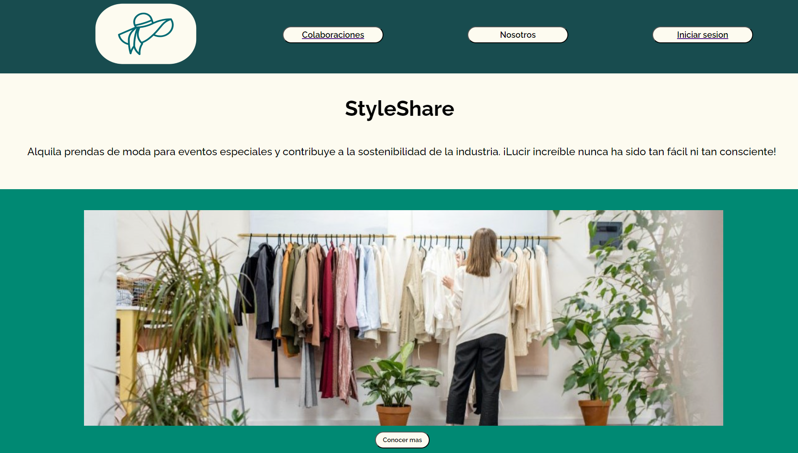
<br>

Sección Nosotros:

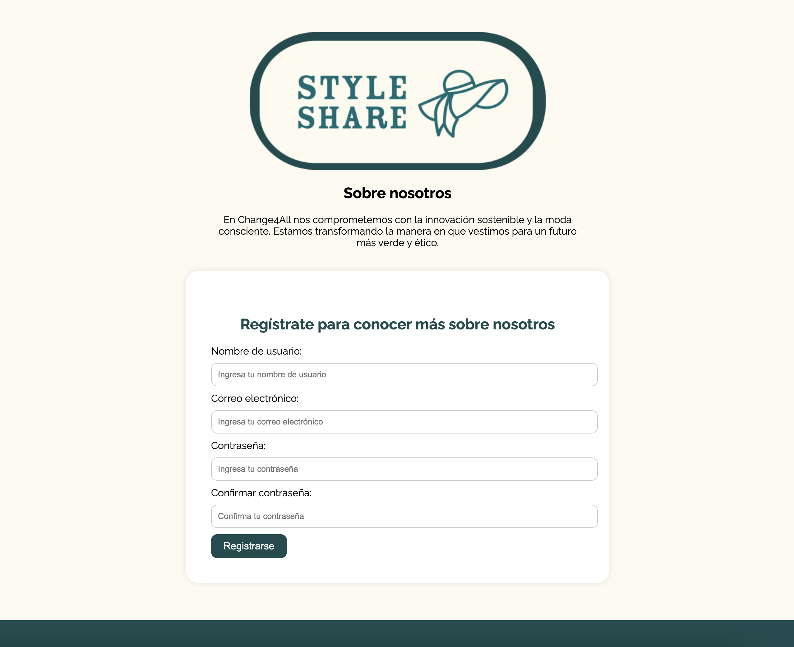

Sección Iniciar Sesión:

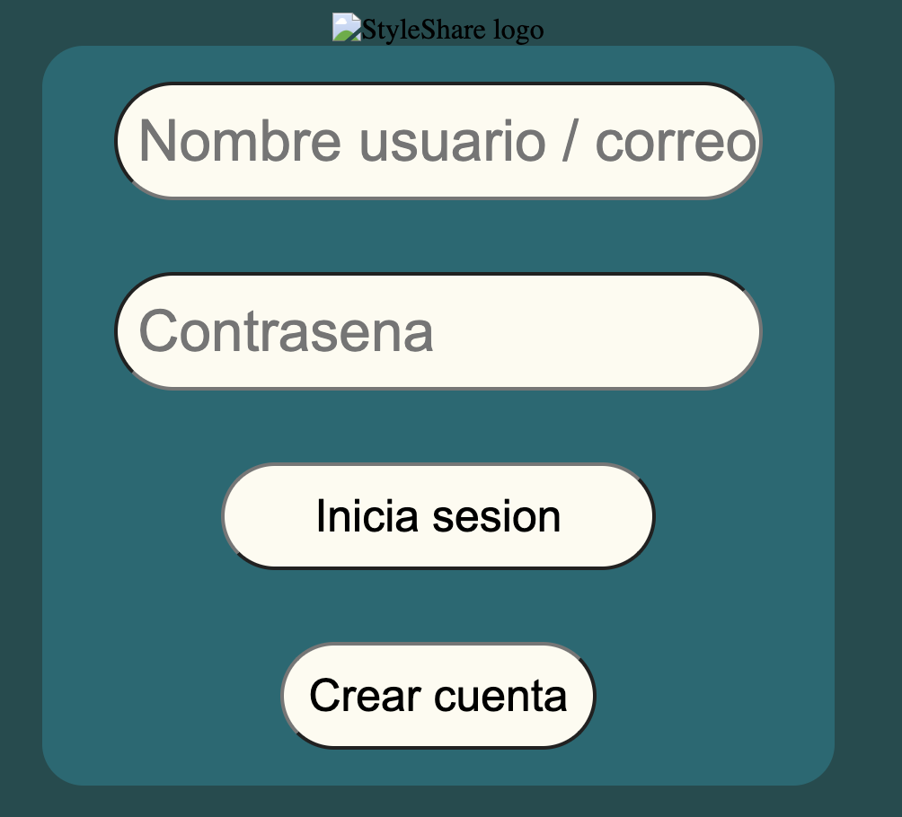

Sección Colaboración:

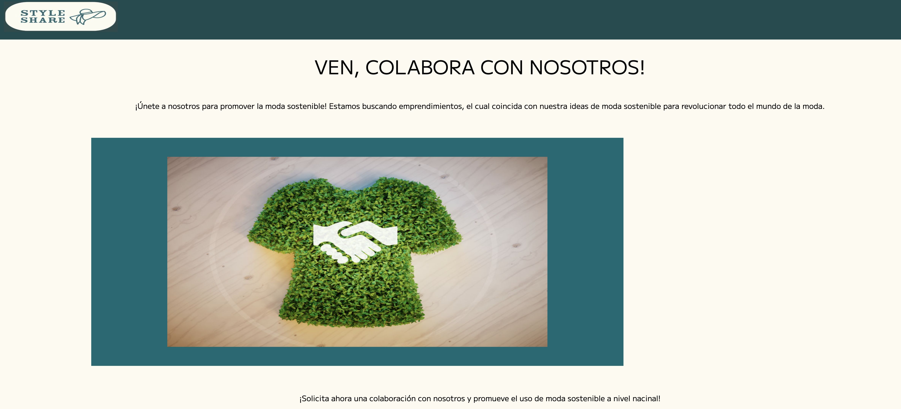
<br>

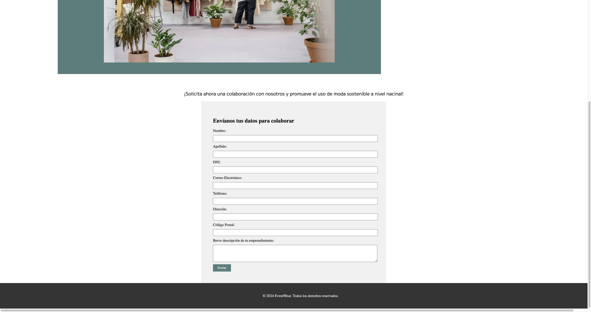

#####         **5.2.1.6. Services Documentation Evidence for Sprint Review.**
Este primer Sprint solo trata la implementación del landing page, por lo que no se empleó ningún servicio adicional.

#####         **5.2.1.7. Software Deployment Evidence for Sprint Review.**
Para la entrega del Sprint número 1, se desplego el landing page parcialmente completa

#####         **5.2.1.8. Team Collaboration Insights during Sprint.**
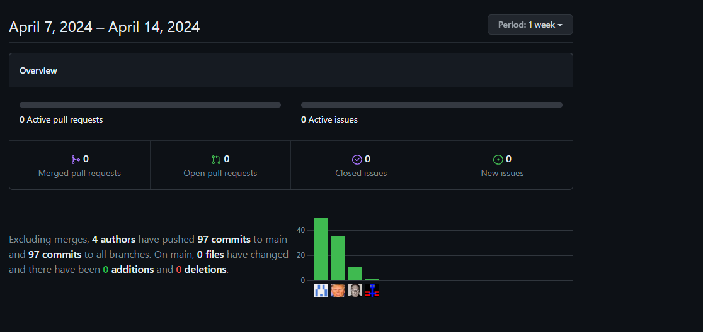
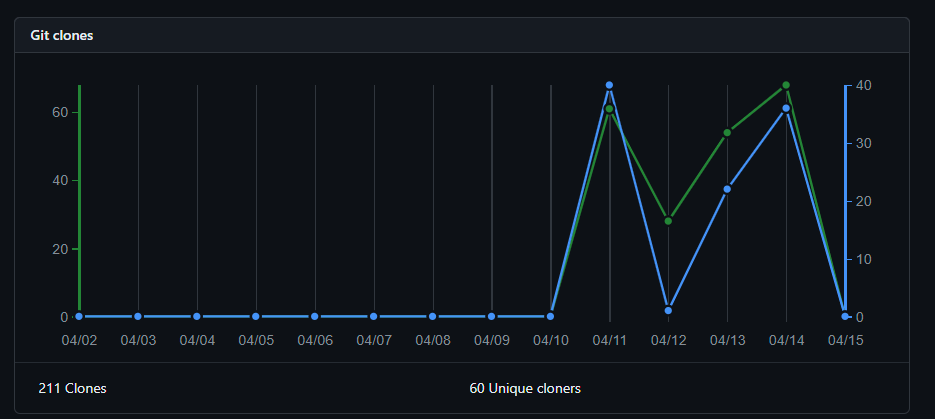


## Conclusiones
La efectividad de la comunicación, tanto oral como escrita, ha sido fundamental en el desarrollo y avance del proyecto. La fluidez en el intercambio de ideas durante las discusiones orales ha permitido una comprensión compartida de los objetivos y ha fomentado la colaboración entre los miembros del equipo. Este enfoque continuará siendo promovido para sostener el progreso y la cohesión grupal. Por otro lado, la comunicación escrita ha desempeñado un papel crucial en la documentación del progreso del proyecto y en la clarificación de los entregables.


## Bibliografía
American Psychological Association. (2020). Publication manual of the American Psychological Association (7th ed.). https://psycnet.apa.org/doi/10.1037/0000165-000


Bala, D. (24 de mayo de 2021). Alquiler de ropa: Rentar tu propio clóset es la nueva tendencia. Vogue. https://www.vogue.mx/sustentabilidad/articulo/alquiler-de-ropa-de-tu-closet-todo-sobre-la-nueva-tendencia-de-moda
 

El Ágora. (18 de agosto de 2021). La moda rápida tiñe de contaminación el agua de África. https://www.elagoradiario.com/agua/contaminacion-agua-rios-africa-industria-textil-moda-rapida/


Gomez, A. y Fuenmayor, O. (5 de febrero de 2020). La insostenible sostenibilidad del fast-fashion. Seampedia. http://mitimitiestudio.com/20/seamp/la-insostenible-sostenibilidad-del-fast-fashion/


Greenpeace. (22 de abril de 2022). Las exportaciones ropa usada terminan en montañas de basura, contaminando el aire y los ríos en África. https://es.greenpeace.org/es/sala-de-prensa/comunicados/las-exportaciones-ropa-usada-terminan-en-montanas-de-basura-contaminando-el-aire-y-los-rios-en-africa/
 

Organización de las Naciones Unidas. (12 de abril de 2019). El costo ambiental de estar a la moda. https://news.un.org/es/story/2019/04/1454161


## Anexos
[**Entrega Exposicion TB1 **](https://upcedupe-my.sharepoint.com/:v:/g/personal/u202213358_upc_edu_pe/EU4b9t8_q21Etq6ERGfw7JEB5zhYuBgQE8bMf82F7WBAlg?nav=eyJyZWZlcnJhbEluZm8iOnsicmVmZXJyYWxBcHAiOiJTdHJlYW1XZWJBcHAiLCJyZWZlcnJhbFZpZXciOiJTaGFyZURpYWxvZy1MaW5rIiwicmVmZXJyYWxBcHBQbGF0Zm9ybSI6IldlYiIsInJlZmVycmFsTW9kZSI6InZpZXcifX0%3D&e=2r0e5s)
